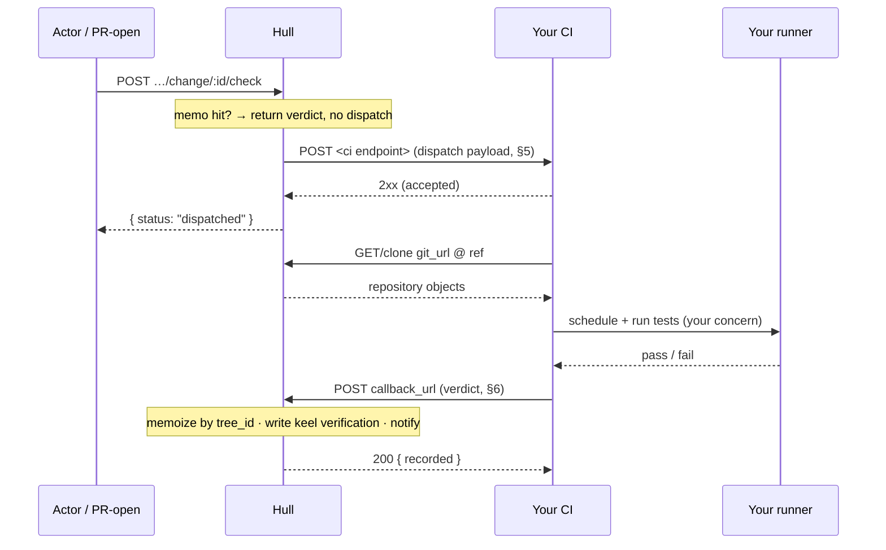

# Hull CI Integration Standard

**Contract version: 1** &nbsp;·&nbsp; Status: stable &nbsp;·&nbsp; Transport: HTTP/JSON

This is the complete standard for building a CI system that runs checks for a Hull repository. If
your system speaks the two HTTP calls below, it works with Hull. Nothing else is required, and Hull
imposes nothing on how you queue, schedule, isolate, or scale — that is entirely yours.

The key words **MUST**, **MUST NOT**, **SHOULD**, and **MAY** are used as in RFC 2119.

---

## 1. Design principles

1. **Hull is a dispatcher, not a scheduler.** Hull POSTs a job and waits for a result. It owns no
   queue, no runner pool, and no knowledge of your internals.
2. **The change is the unit of work, the *tree* is the identity.** Every job names a keel `change`
   and its content-addressed `tree_id`. Two changes with an identical tree are the same work.
3. **Asynchronous by default.** A verdict arrives whenever your system is done, via a callback. Hull
   never blocks on your runners.
4. **The source of truth is Hull.** Verification state, memoization, and de-duplication live in Hull.
   Your system is stateless from Hull's point of view: it receives a job and reports a verdict.

---

## 2. Terminology

| Term | Meaning |
|------|---------|
| **change** | A keel change id (hex). The revision under test. |
| **tree_id** | The keel tree content-address for that change. The cache key for a verdict. |
| **dispatch** | The request Hull sends your system to start a job (§5). |
| **callback** | The request your system sends Hull with the verdict (§6). |
| **verdict** | `green` \| `red` \| `errored` (§7). |
| **CI endpoint** | The HTTPS URL Hull POSTs dispatches to, per repo or per instance (§4). |

---

## 3. Sequence



---

## 4. Configuration & endpoint resolution

A repository's CI endpoint is resolved in this order; the first hit wins:

1. **Per-repo** — set via the config API below.
2. **Instance default** — the `HULL_CI_URL` (and `HULL_CI_SECRET`) the Hull operator sets.
3. **None** — Hull falls back to its built-in local runner (self-host convenience). Your system is
   not involved.

```
GET  /api/repos/:tenant/:repo/ci-config
     → { "url": "https://ci.example/hull" | null,
         "has_secret": true,
         "source": "repo" | "instance" | "none (built-in local runner)" }

PUT  /api/repos/:tenant/:repo/ci-config          (owner/admin only)
     { "by": "<actor-id>", "url": "https://ci.example/hull", "secret": "<shared secret>" }
     → { "url": "...", "cleared": false }
```

Setting `url` to `""` clears the per-repo endpoint (falls back to the instance default). The `secret`
is write-only; `GET` never returns it, only `has_secret`.

---

## 5. Dispatch (Hull → your CI)

When a check is triggered for a change whose tree has no memoized verdict, Hull sends:

```
POST <ci endpoint>
Content-Type: application/json
X-Hull-CI-Version: 1
X-Hull-CI-Secret: <shared secret>          # present iff a secret is configured
```
```json
{
  "repo":         "tankrap/hull",
  "change":       "21ea2242186c99ff…",
  "tree_id":      "f7a2d47020c63c8e…",
  "intent":       "fixes #6 pagination off-by-one",
  "author":       "justin",
  "git_url":      "https://hull.example/tankrap/hull",
  "ref":          "21ea2242186c99ff…",
  "callback_url": "https://hull.example/api/repos/tankrap/hull/change/21ea…/ci-result"
}
```

### Field reference (normative)

| Field | Type | Notes |
|-------|------|-------|
| `repo` | string | `tenant/repo`. Routing/logging only. |
| `change` | string | keel change id. Include it in your callback path (Hull derives it from `callback_url`; you MUST use `callback_url` verbatim). |
| `tree_id` | string | Content-address of the source. You **MAY** use it as your own cache key; you **MUST NOT** need it to run. |
| `intent` | string | Human summary of the change. Display only. |
| `author` | string | Actor handle. Display only. |
| `git_url` | string | Clone URL. Hull serves git smart-HTTP at this path. |
| `ref` | string | The revision to check out after cloning (equal to `change`). |
| `callback_url` | string | Where to POST the verdict (§6). Treat as **opaque**; do not construct it yourself. |

**Your CI MUST:**
- Respond `2xx` promptly to acknowledge receipt (this is *accepted*, not *done*). A non-2xx response
  makes Hull treat the dispatch as failed and surface an error to the caller.
- Treat the body as **forward-compatible**: ignore unknown fields. Hull MAY add fields in later
  contract versions without bumping `X-Hull-CI-Version` for additive changes.

**Your CI SHOULD:**
- Verify `X-Hull-CI-Secret` on the dispatch if you configured one, and reject mismatches.

---

## 6. Fetching the source

Clone `git_url` and check out `ref`:

```
git clone <git_url> work && cd work && git checkout <ref>
```

Hull serves standard git smart-HTTP (`info/refs?service=git-upload-pack`, `git-upload-pack`) at
`git_url`. Your runners **SHOULD** perform the clone inside the isolated sandbox, not on the
control-plane host.

> **Private repositories:** clone auth is out of scope for contract v1 (repos are assumed fetchable
> by the CI system's network identity). A scoped, short-lived fetch token in the dispatch payload is
> reserved for a future version; ignore its absence today.

---

## 7. Result callback (your CI → Hull)

When the job finishes — success, failure, or infrastructure error — POST the verdict to the exact
`callback_url` from the dispatch:

```
POST <callback_url>
Content-Type: application/json
X-Hull-CI-Secret: <shared secret>          # MUST echo it if the endpoint has a secret
```
```json
{ "status": "green", "summary": "42 tests, 0 failed, in 8.1s" }
```

| Field | Type | Required | Notes |
|-------|------|----------|-------|
| `status` | enum | yes | `green` \| `red` \| `errored`. Anything else → `400`. |
| `summary` | string | no | One-line human summary, shown in the UI and notifications. |

Response: `200 { "recorded": "<status>" }`.

### Status semantics (normative)

| `status` | Meaning | Hull's action |
|----------|---------|---------------|
| `green` | checks passed | memoize verdict by `tree_id`; set keel verification **green**; notify `ci_passed` |
| `red` | checks failed | memoize verdict by `tree_id`; set keel verification **red**; notify `ci_failed` |
| `errored` | could not produce a verdict (timeout, infra failure, no tests) | **not** memoized; verification unchanged |

Return **`errored`, not `red`,** for infrastructure problems. `red` is a statement about the code;
`errored` is a statement about your system. Only `green`/`red` are cached, so an outage never poisons
a tree's verdict — a later re-check will re-dispatch.

---

## 8. Authentication

- A repo (or the instance) **SHOULD** configure a shared `secret`.
- When set, Hull sends `X-Hull-CI-Secret` on the **dispatch**, and **requires** it on the
  **callback** — a missing or wrong secret on the callback is rejected `401`, and no verdict is
  recorded.
- The secret is symmetric and per-endpoint. Rotate by `PUT`-ing a new `ci-config`.
- Transport **SHOULD** be HTTPS in production; the secret is a bearer credential.

---

## 9. What Hull guarantees (so you don't implement it)

- **Content-addressed memoization.** A tree with an existing `green`/`red` verdict is **never
  re-dispatched** — the check returns the cached verdict instantly.
- **In-flight de-duplication.** While a tree's job is outstanding, a second check for the same tree
  does **not** dispatch again; it returns `pending`. (A caller MAY force a re-dispatch with
  `{"force": true}` on the check, which bypasses both the memo and this guard.)
- **Verification write-back.** A `green`/`red` verdict updates keel verification, which gates PR
  merges and feeds the reconciliation ledger.
- **Notifications.** Hull emits `ci_passed` / `ci_failed` to the relevant actors.

Because de-dup is best-effort (in-memory), your system **SHOULD** itself be idempotent per
`(tree_id)` or per `callback_url`: a duplicate dispatch **MUST** be safe to run, and a duplicate
callback for an already-recorded tree simply re-affirms the same verdict.

---

## 10. Timeouts, retries, lost callbacks

- Hull does not time out a dispatched job; the verdict is whatever your callback eventually says.
  Your system **SHOULD** enforce its own job timeout and report `errored` when it fires.
- If a callback never arrives (your system crashed), the tree stays unverified. A human (or an
  automated re-check with `force`) re-triggers it. Hull does not poll you.
- If Hull is unreachable when you call back, retry with backoff; the callback is idempotent.

---

## 11. Conformance checklist

A conforming CI integration:

- [ ] Accepts `POST` at its configured endpoint and returns `2xx` on receipt.
- [ ] Verifies `X-Hull-CI-Secret` on dispatch when a secret is configured.
- [ ] Clones `git_url`, checks out `ref`, runs its checks in isolation.
- [ ] POSTs `{status, summary}` to the exact `callback_url`, echoing `X-Hull-CI-Secret`.
- [ ] Uses `errored` (not `red`) for infrastructure failures.
- [ ] Ignores unknown dispatch fields (forward-compatible).
- [ ] Is safe under duplicate dispatch and duplicate callback.

---

## 12. Reference implementation (illustrative)

A minimal, single-file CI stand-in — receive the dispatch, run, call back — lives at
`scripts/fake-ci.py`. In pseudocode:

```python
def on_dispatch(req):
    assert req.header("X-Hull-CI-Secret") == MY_SECRET      # §8
    job = req.json()
    ack(202)                                                # §5: acknowledge, don't block

    workdir = clone(job["git_url"], ref=job["ref"])         # §6
    result  = run_tests_in_sandbox(workdir)                 # your concern

    status  = "green" if result.ok else "red"               # §7
    if result.infra_error: status = "errored"
    post(job["callback_url"],
         json={"status": status, "summary": result.summary},
         headers={"X-Hull-CI-Secret": MY_SECRET})
```

---

## 13. Versioning

- The current contract is **version 1**, advertised on every dispatch as `X-Hull-CI-Version: 1`.
- **Additive** changes (new dispatch fields, new optional callback fields) do **not** bump the
  version; integrations MUST tolerate them.
- **Breaking** changes (renamed/removed fields, changed semantics) bump the version. Hull MAY, for a
  transition period, support multiple versions and let an endpoint negotiate via the header.
- Treat any field not defined in this document as reserved.
