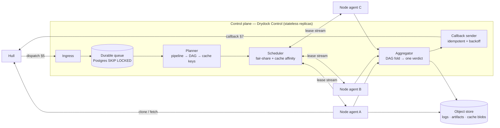

# Drydock — a high-performance CI runner service for Hull

**Status:** draft design · **Conforms to:** `CI-SPEC.md` contract v1 · **Author:** design draft, not yet built

*Drydock* is a placeholder name (keel → hull → drydock); swap it if something better lands.

---

## 0. What this is

A standalone CI system that speaks Hull's two-call contract (`CI-SPEC.md`) and, behind that contract,
runs a **central orchestrator + fleet of execution nodes**. The control plane owns queueing,
scheduling, caching decisions, and the verdict; **nodes own all execution** — clone, sandbox, run,
stream logs. No user code ever executes on the control plane.

Hull deliberately owns none of this (§1 of the spec: "Hull is a dispatcher, not a scheduler"), so
everything below is ours to design. The only fixed points are: accept a dispatch and return 2xx fast,
and eventually POST one `{status, summary}` to `callback_url`.

The thesis: **CI latency is dominated by work we already did and by bytes we already have.** Hull
memoizes whole trees; Drydock's job is to memoize *below* that granularity and to schedule so the
bytes are already on the machine that runs the job. Everything in this design serves those two ideas.

---

## 1. Goals, non-goals, targets

### Goals

1. **Conform to contract v1** exactly, including the `errored` vs `red` discipline.
2. **Central ↔ node split** — orchestrator is stateless-ish and small; nodes are the muscle and are
   individually disposable.
3. **Exploit content addressing.** keel gives every tree and subtree a content address for free.
   Step-level cache keys should be a metadata computation, not a filesystem walk.
4. **Fast, in this order:** memo hit (no run) → warm node, warm cache (partial run) → cold run.
5. **Multi-tenant safe.** Untrusted code runs constantly; a job must not be able to reach another
   tenant's cache, credentials, or network.
6. **Horizontally boring.** Add nodes → more throughput, no reconfiguration. Nodes dial out; no
   inbound ports, so spot/edge/on-prem capacity all work.

### Non-goals (v1)

- Deployment/CD (Drydock produces verdicts, not releases).
- A general workflow engine. The pipeline format stays declarative and small — no raw shell on the
  host, matching Hull's stated rule.
- Replacing Hull's built-in local runner. That stays as the zero-config self-host path.
- Cross-repo/monorepo dependency graphs beyond a single repo's pipeline.

### Performance targets (p50 / p99, to be held as SLOs)

| Path | Target |
|---|---|
| Dispatch → 2xx ack | 15 ms / 60 ms |
| Dispatch → first step executing (warm node, warm workspace) | 300 ms / 1.5 s |
| Dispatch → first step executing (cold node, cold workspace) | 4 s / 15 s |
| Workspace materialization, 100k-file tree, warm ancestor present | 300 ms / 800 ms |
| Sandbox spawn (container tier, warm pool) | 40 ms / 200 ms |
| Sandbox spawn (microVM tier, snapshot restore) | 150 ms / 600 ms |
| Final step done → callback delivered | 100 ms / 1 s |
| Control-plane throughput, single instance | 5 000 dispatches/min |

Cold-vs-warm is the whole game: the numbers above are the argument for cache-affinity scheduling
(§5.3) and warm pools (§6.4).

---

## 2. Fit against CI-SPEC v1 — and four gaps

Conformance is straightforward (§11 checklist maps one-to-one onto §4 and §8 below). Four places
where the contract as written constrains the design; each has a spec-legal workaround today and a
proposed additive change.

| # | Gap | Workaround today | Proposal |
|---|---|---|---|
| G1 | **Fetch is git-shaped.** §6 says clone `git_url` and check out `ref`. A plain git clone throws away the delta-materialization win — the node can't say "I already have tree `f7a2…`, send me the difference." | Nodes keep a persistent bare mirror per repo and do an incremental fetch; ~80% of the win, all of it inside git semantics. | Additive dispatch field `keel_url` (and/or a QUIC keeld endpoint). Nodes that embed `keel-store` materialize by tree address; everyone else ignores the field. Legal under §13 (additive, no version bump). |
| G2 | **Private repos have no auth story** (§6 explicitly out of scope for v1). Every serious deployment needs it on day one. | Network identity / IP allowlist between Drydock and Hull — fine for a single-operator deployment, wrong for hosted. | Take the reserved short-lived fetch token now: `fetch_token` + `fetch_token_expires_at` in the dispatch, scoped to `(repo, ref)`, minted by Hull. Node gets it per-job and never persists it. |
| G3 | **No cancellation.** If a change is superseded, the PR closes, or a tree gets a verdict elsewhere, Hull cannot tell us to stop. We burn node-minutes on dead work. | Internal supersede logic only: a newer dispatch for the same `(repo, branch-ish lineage)` cancels older in-flight jobs; jobs also self-cancel on their own timeout. | Drydock exposes `POST <ci endpoint>/cancel {change, tree_id, reason}`; Hull calls it when it invalidates work. Purely additive on both sides. |
| G4 | **One verdict, no link.** `{status, summary}` gives the user a sentence and nowhere to click. A red build with 3 failing steps compresses to one line. | Put a URL inside `summary` text. Ugly but works — Hull renders the string. | Additive optional callback field `details_url` (§13 permits new optional callback fields). Hull's `ci_result` handler currently reads only `status`/`summary` and drops the rest, so this needs a small Hull-side change to persist and render it. |

None of these block v1. G2 and G4 are the two I'd want landed before hosted launch.

---

## 3. Architecture



**Control plane** — `drydock-control`, Rust + axum (same stack as Hull; can share `hull-plugin` types
directly). Replicas are interchangeable; all durable state is in Postgres + object storage. In-memory
state (node roster, warm-cache sketches) is rebuildable from node heartbeats within one heartbeat
interval, so a replica can be killed at any time.

**Node** — `drydock-node`, Rust, one per machine. Owns local disk, the workspace cache, the sandbox
pool, and the local cache daemon. Dials out to control; needs no inbound connectivity.

**Why Rust for both:** the node needs cgroup v2, namespace, seccomp, and CoW-filesystem control with
no runtime between it and the syscalls, and the control plane wants to reuse Hull's `keel-store` /
`hull-plugin` types without a serialization boundary. Same argument Hull already made.

---

## 4. Control plane

### 4.1 Ingest — ack fast, durably

```
POST /hull   (the configured CI endpoint)
  1. constant-time compare X-Hull-CI-Secret        → 401 on mismatch
  2. reject unknown X-Hull-CI-Version major        → 400
  3. INSERT job ON CONFLICT (tree_id, repo) DO NOTHING   ← idempotency, §9
  4. 202 {"accepted": true, "job_id": "..."}
```

The ack is returned only after the job row commits — an ack means "durably ours." Everything after
that is asynchronous. Target ≤15 ms p50, which one indexed insert comfortably meets.

Idempotency key is `(repo, tree_id)`, per the spec's advice that we be idempotent per tree. A
duplicate dispatch for a tree with a live job attaches to that job and will receive the same verdict;
a duplicate for a finished job re-sends the recorded verdict to the callback URL (cheap, and it heals
lost callbacks).

### 4.2 Job & step model

```
job    (id, repo, change, tree_id, callback_url, secret_ref, state, priority,
        trust_tier, created_at, deadline_at, verdict, summary, details_url)
step   (id, job_id, name, state, cache_key, node_id, lease_expires_at,
        attempt, exit_code, started_at, finished_at, log_object_key)
edge   (job_id, from_step, to_step)              -- the DAG
```

Job states: `queued → planning → running → {green | red | errored} → reported`.
Step states: `pending → ready → leased → running → {passed | failed | errored | cached | skipped}`.

`reported` is separate from the verdict so the callback sender can retry independently of job
completion, and so a duplicate dispatch can re-report without re-running.

### 4.3 Planning

The planner needs the pipeline definition *without cloning at the control plane*. It fetches the
single file over Hull's blob API (`resolve_blob` already exists server-side and is content-addressed),
which is one small HTTP GET, cacheable by blob id forever.

```yaml
# .hull/ci.yml
version: 1
image: rust:1.83                     # OCI ref, resolved to a digest at plan time
trust: trusted                       # trusted | untrusted → isolation tier (§7.2)
steps:
  - name: fmt
    run: cargo fmt --check
    inputs: ["**/*.rs", "rustfmt.toml"]
  - name: build
    run: cargo build --workspace --all-targets
    inputs: ["crates/**", "Cargo.toml", "Cargo.lock"]
    cache: ["target/", "~/.cargo/registry"]
  - name: test
    needs: [build]
    run: cargo test --workspace
    inputs: ["crates/**", "Cargo.toml", "Cargo.lock"]
    shard: auto                      # split by historical timing (§6.5)
    timeout: 20m
  - name: scan
    uses: hull/secret-scan           # built-in action, no user shell
```

`run` strings are executed **inside the sandbox only** — never on the node host, never on control.
`uses:` names built-in actions (secret scan, artifact publish) implemented in the node binary.

No `.hull/ci.yml`? Fall back to autodetect matching Hull's built-in runner (`Cargo.toml → cargo test`,
`package.json → npm test`) so behavior doesn't change when a repo points at Drydock. No pipeline and
no detectable command → `errored` with a clear summary, per §7 ("no tests" is explicitly `errored`).

**Cache key per step** — this is where keel pays off:

```
step_key = H( pipeline_version, step_def_canonical, image_digest,
              subtree_digest(inputs_glob) …,          ← from keel, no file hashing
              env_allowlist_values,
              step_key(each dependency) )
```

`subtree_digest` resolves a path glob to keel content addresses via metadata lookup. On a
100k-file repo this is microseconds of tree walking versus seconds of hashing — the reason step-level
memoization is affordable here and expensive on a git-shaped CI.

A step whose `step_key` has a recorded `passed` result is marked `cached` and never dispatched. If
every step is cached, the job resolves without touching a node at all and the callback goes out in
milliseconds — a second-order memo underneath Hull's whole-tree memo (§6.1).

### 4.4 Queue

Postgres `FOR UPDATE SKIP LOCKED` over the `step` table, partitioned by ready-state. One dependency,
transactional with job state, good to roughly 10k steps/sec — well past where we'd need it. If it
becomes the bottleneck, NATS JetStream is the escape hatch; deliberately not day-one.

**Fairness:** weighted fair queueing over tenants. Each tenant gets a share of fleet slots; a tenant
that floods the queue drains only its own share. Within a tenant: priority classes
(`interactive` — an actor clicked check; `background` — merge-queue, nightly), then FIFO.

**Admission control:** per-tenant caps on concurrent steps and total node-minutes/hour, sourced from
the tenant's plan. Over cap → the job queues rather than errors (queuing is honest; `errored` is for
our failures, and a plan limit isn't a failure — it's a wait, surfaced in the eventual summary if it
dominates the runtime).

---

## 5. Scheduling

### 5.1 The node roster

Every node holds one long-lived stream to a control replica and heartbeats every 5 s with:

```
NodeState {
  node_id, labels: {arch, os, gpu, region, tier}, capacity: {slots_total, slots_free},
  load: {cpu, mem, disk_free, io_pressure},
  warm: {
    repos:  [ {repo, materialized_trees: [tree_id…], mirror_head} ],   // bounded, LRU
    caches: cuckoo_filter(step_keys + cache-mount digests)             // ~2 KB, false-positive only
  }
}
```

The warm sketch is a **compact filter, not a list** — a few KB per node per heartbeat, so a
1000-node fleet costs ~2 MB/heartbeat cycle of gossip into control's memory. False positives cost a
mis-routed job (which then does a normal cold fetch); false negatives are impossible. This is the
right error direction.

### 5.2 Placement

Candidate nodes = label match ∧ trust tier match ∧ `slots_free > 0` ∧ not draining.

```
score(node, step) =
      3.0 · workspace_affinity   // node holds this tree, or a near ancestor
    + 2.0 · cache_affinity       // node's filter hits this step's cache mounts
    + 1.0 · (1 − normalized_load)
    − 1.5 · queue_depth_at_node
    + jitter(0.15)               // break hotspots
```

Weights are config, and the ratio of workspace/cache affinity to load is the single most important
tuning knob in the system — it's the difference between a 300 ms and a 15 s start.

**Default home node:** rendezvous (HRW) hashing on `(repo, step_name)` gives each step a stable home
even with zero warm information, so a fleet with a cold cache still converges to locality instead of
smearing every repo across every node. Overflow to the next-best when the home node is full — bounded
so one busy repo can't pin a node.

### 5.3 Leases

Assignment is a **lease**, not a fire-and-forget send:

```
lease = (step_id, node_id, expires_at = now + 30s)
node renews every 10s while running; control extends expires_at
missed renewal → lease expires → step returns to ready, attempt += 1
attempt > max_attempts (3) → step errored ("lost node ×3")
```

A node that dies mid-job costs at most 30 s of dead air, and no operator action. A node that is merely
partitioned will find its lease revoked when it reconnects and drops the work — the control plane's
lease record is authoritative, so a step is never counted twice even if it *ran* twice (which the
sandbox makes harmless: steps must be safe to re-run, same rule the spec applies to us).

---

## 6. The performance story

Six mechanisms, roughly in order of payoff.

### 6.1 Three layers of "don't run it again"

| Layer | Owner | Key | Effect |
|---|---|---|---|
| 1. Tree memo | **Hull** (exists) | `tree_id` | Identical tree never even dispatched |
| 2. Step memo | Drydock control | `step_key` (§4.3) | Rebase, doc-only change, or unrelated-crate edit skips most steps |
| 3. Action cache | Node cache daemon | compiler/tool-level (sccache, cargo, npm, bazel-ish) | Incremental cost *within* a step that does run |

Layer 2 is the new one and the reason this design exists. A typical "fix a typo in the README" change
gets a fresh `tree_id` — Hull *must* dispatch it — but every step whose declared `inputs` didn't
change is a cache hit, so the job resolves in well under a second without a node.

**Rule:** only `passed` results are cached. `failed` is cached too but *separately and shorter-lived*
(it's a real signal — a flaky-looking repeat failure shouldn't rerun the world), and `errored` is
never cached, mirroring the spec's discipline one level down.

### 6.2 Materialize, don't clone

Node workspace lifecycle:

1. **Persistent bare mirror per repo** on each node, incrementally fetched. Never a fresh clone.
2. **Base snapshot** of a recently used tree on a CoW filesystem (btrfs/ZFS subvolume, or overlayfs
   over a base dir on ext4/xfs).
3. **Job workspace** = CoW snapshot of the closest base + apply the delta to the target tree. On the
   keel path (G1) that delta is a content-address diff; on the git fallback it's `checkout` against
   an already-populated worktree.
4. **Teardown** = drop the snapshot. O(1), no `rm -rf` of 100k files.

Cold path (nothing on the node) is a full fetch, and that's the number the affinity scheduler exists
to avoid paying.

### 6.3 Cache mounts, namespaced by trust

Declared `cache:` paths are mounted into the sandbox as an overlay: a shared, read-only lower layer
from the node's cache daemon + a writable upper layer per job. On a passing step the upper layer is
promoted into the shared cache under the step's cache namespace; on failure it's discarded.

Namespace = `(tenant, repo, trust_tier, cache_path)`. **Never crosses tenants, and never crosses trust
tiers** — an untrusted job (fork PR, unknown contributor) reads from the trusted cache but writes only
to its own throwaway namespace. That single rule closes the cache-poisoning hole that this kind of
system otherwise walks straight into.

### 6.4 Warm pools

Each node keeps N pre-booted sandboxes per hot image digest — containers already unpacked, microVMs
already snapshot-restored, workspace mount point empty and waiting. A job start is then "bind the
workspace and exec," not "pull an image and boot." This is what buys the 40 ms container / 150 ms
microVM spawn numbers.

Pool size is demand-predicted per node from the last hour's image mix, floor 1 for any image seen in
the last 24 h, capped by memory pressure.

### 6.5 Fan-out and sharding

Independent DAG steps go to *different nodes* simultaneously — a 4-step pipeline with one dependency
edge is wall-clock 2 steps deep, not 4. `shard: auto` splits a test step into K shards using recorded
per-test timings, bin-packed to equalize shard duration (LPT scheduling — simple, within 4/3 of
optimal, and completely adequate here). K is chosen so each shard lands near a target duration
(default 90 s) rather than being a fixed number, because fixed shard counts get pathological as suites
grow.

Shard results fold: all pass → step passes; any fail → step fails, and the failing shard's log is what
the summary points at.

### 6.6 Fail fast, report once

The contract gives us exactly one verdict, so the aggregator's job is to reach it as early as it
legitimately can:

- First `failed` step that is not marked `continue_on_error` → **cancel all in-flight siblings**
  (leases revoked, sandboxes killed) and report `red` immediately. No reason to finish a build whose
  verdict is already determined.
- All steps `passed`/`cached` → `green`.
- Any step `errored` while none failed → **`errored`**, not red. Infra problems are ours, and the
  spec is explicit that only green/red get memoized so an outage must never poison a tree.

Summary format, since it's one line in Hull's UI:

```
green:   "18 steps (14 cached), 1 240 tests, 0 failed — 47s"
red:     "test/shard-3 failed: 2 of 1 240 tests — auth::token::expiry, auth::token::refresh — 61s"
errored: "node lost 3× on step `build` — no verdict produced"
```

With G4 landed, the same information gets a `details_url` to the full log view.

---

## 7. Nodes

### 7.1 Node agent

Single Rust binary, supervised, holding:

- **Control link** — one multiplexed bidirectional stream (gRPC over HTTP/2; QUIC if we want to match
  keel's transport and get better head-of-line behavior on lossy links — recommended, since keel
  already pulls in a QUIC stack). Outbound-only. Reconnect with backoff + jitter; leases survive brief
  disconnects, so a reconnect inside the lease TTL resumes rather than restarts.
- **Executor pool** — one slot per CPU group (default: 2 cores + 4 GB per slot; declared in node config).
- **Workspace manager** (§6.2) with an LRU over base snapshots bounded by disk watermark.
- **Cache daemon** (§6.3) with a GC by LRU + total-size cap.
- **Log shipper** — line-oriented, batched to object storage, with a live tail forwarded over the
  control link only while someone is watching.

### 7.2 Isolation tiers

| Tier | Mechanism | For | Boot |
|---|---|---|---|
| **trusted** | OCI container: user namespace + cgroup v2 (cpu/mem/pids/io) + seccomp profile + read-only rootfs + tmpfs `/tmp` | first-party repos, member-authored changes | ~40 ms warm |
| **untrusted** | microVM (Firecracker / Cloud Hypervisor) from snapshot, virtio-fs workspace, no host kernel sharing | fork PRs, unknown contributors, anything the tenant marks untrusted | ~150 ms warm |

The tier comes from `trust:` in the pipeline, clamped by policy: a tenant may raise the tier but not
lower it below what the platform requires for that author class. Untrusted work never lands on a node
that is also running trusted work for another tenant (label partition).

**No raw shell on the host, ever** — matching Hull's stated CI rule. The node binary itself never
interpolates user strings into a host command line; `run:` is passed as an argv into the sandbox.

### 7.3 Egress policy

Default deny, with an allowlist per job: the Hull instance (for fetch), the package registries the
pipeline declares, the object store endpoint. Everything else is dropped at the node's netns. This is
what stops a compromised build from exfiltrating the workspace, and it's cheap — an nftables ruleset
per netns.

### 7.4 Credentials

The node holds **no long-lived tenant credentials**. Per job, control mints a short-lived token
scoped to `(repo, ref, object-store prefix)` with a TTL slightly longer than the job deadline. It is
delivered over the control link, injected as an env var *into the sandbox only*, and never written to
disk. Secret values are registered with the log shipper's scrubber before the step starts, so an
accidental `echo` is redacted in the stored log.

The node's own identity to control is a per-node keypair enrolled at provisioning — an Ed25519
identity, which also lets node attestations ride the same scheme Hull already uses for actors.

---

## 8. Correctness, failure, and the callback

### 8.1 Callback delivery

The callback is the one externally visible output, so it gets its own durable state and its own
worker:

- Sent once the job reaches a terminal verdict; retried with exponential backoff + jitter (1 s → 5 min,
  ~12 attempts over ~1 h).
- Uses `callback_url` **verbatim** (§5: opaque, never constructed), echoing `X-Hull-CI-Secret` (§8).
- Idempotent by construction — Hull's `ci_result` re-affirms the same verdict, and duplicate delivery
  is explicitly safe per §9.
- If it exhausts retries, the job parks in `report_failed` and alerts. Hull's stance (§10) is that the
  tree simply stays unverified and a human re-triggers — so we do not need heroics, but we do need
  the alert, because silent non-delivery looks exactly like "CI is broken" to a user.

### 8.2 Timeouts

Per the spec we must enforce our own (§10: Hull never times out). Three levels:

| Scope | Default | On expiry |
|---|---|---|
| Step | 20 min (pipeline-overridable) | step `errored`; job `errored` |
| Job (wall clock, all steps) | 60 min | cancel everything, `errored` |
| Queue wait | 30 min | `errored` ("no capacity") |

All three report `errored`, never `red` — the code didn't fail, we did.

### 8.3 Poison and flake handling

- A step that errors on ≥2 distinct nodes is marked **node-independent** and stops being retried;
  further retries would just burn capacity.
- A step that *fails* (red) is not retried by default. Auto-retrying red is how a CI system starts
  lying about flakiness. Opt-in per step (`retry: 2`) with the retry count surfaced in the summary,
  so a flaky suite is visible rather than laundered.
- Per-test flake tracking (same test, same tree, both outcomes seen) feeds a report, not a retry.

### 8.4 Verdict integrity

A step's result is only accepted from the node that currently **holds its lease**. A late result from
an expired lease is dropped. This is what makes "a step may run twice" harmless: it may run twice, but
exactly one run can ever be counted.

---

## 9. Multi-tenancy & security summary

The threat model is simple and severe: **we execute attacker-supplied code on our machines, on
purpose, all day.** The controls, gathered:

1. Untrusted work in microVMs, never sharing a kernel with other tenants' work (§7.2).
2. No ambient credentials on nodes; per-job short-lived scoped tokens (§7.4).
3. Default-deny egress per job netns (§7.3).
4. Cache namespaces never cross tenant or trust tier (§6.3).
5. Workspaces are CoW snapshots destroyed at teardown; nothing survives a job except explicitly
   declared cache paths and artifacts.
6. Control plane never executes user code, never clones a repo, and parses only the pipeline YAML
   (with size, depth, and step-count limits, since that YAML is also attacker-supplied).
7. Secret scrubbing in the log path; secrets never at rest on node disk.
8. Constant-time secret comparison on both dispatch and callback; secrets stored as hashes plus a
   sealed copy for outbound echo, rotated by re-`PUT`ing `ci-config`.

**On Hull's accountability invariant:** Drydock is not an *authoring* actor — it emits a verdict, not
a change, comment, or review. It therefore doesn't need a delegation chain rooted at a human. The
moment we add triage-that-comments or fix-that-commits (Hull M5/M6), those actions must go through
Hull's existing delegation scheme and the human review gate; they'd be a Hull-side agent consuming
Drydock's output, not a Drydock feature. Worth keeping that boundary crisp.

---

## 10. Observability

- **Metrics** (Prometheus): queue depth by tenant/priority, dispatch→start latency histogram (split
  warm/cold — the single most important chart in the system), step duration by name, cache hit rate
  per layer, node slot utilization, lease-expiry rate, callback delivery latency and failures,
  sandbox spawn time by tier.
- **Tracing** (OpenTelemetry): one trace per job, spans for plan / queue-wait / placement /
  materialize / spawn / run / report. Job id propagated from the dispatch so a Hull-side trace can
  stitch to ours.
- **Logs:** object storage, keyed `repo/tree_id/step/attempt`, retained per plan; live tail over the
  control link only while a viewer is attached.
- **The one operator dashboard:** where is time going *right now* — queued vs materializing vs
  running vs reporting, stacked. If that chart is mostly "materializing," affinity is misconfigured;
  if it's mostly "queued," we're short on capacity. Every capacity decision reads off it.

---

## 11. Scaling and cost

- **Control:** stateless replicas behind a load balancer; Postgres primary + read replicas. One
  replica handles the target throughput; run three for availability.
- **Nodes:** stateless-by-design (all durable state is reconstructible), so autoscale on queue depth
  per label class. Scale-up is fast; scale-*down* must drain (finish leases, refuse new) and should
  prefer evicting nodes with the *coldest* caches — a naive LIFO scale-down throws away exactly the
  warm state the scheduler depends on.
- **Spot capacity** works because lease expiry already handles disappearance, but only for
  `background` priority; interactive work goes to on-demand so an interactive check isn't at the mercy
  of a preemption.
- **Cost lever ranking:** step memoization > cache affinity > spot > node sizing. The first two reduce
  work; the others just make the same work cheaper.

---

## 12. Open decisions

| # | Question | Recommendation |
|---|---|---|
| D1 | Transport: gRPC/HTTP2 vs QUIC | **QUIC** — keel already brings the stack, and node links are long-lived over unreliable networks where HOL blocking hurts. |
| D2 | Queue: Postgres SKIP LOCKED vs NATS | **Postgres** to start; one dependency, transactional with job state. Revisit past ~5k steps/sec. |
| D3 | CoW filesystem: btrfs vs ZFS vs overlayfs | **btrfs** on Linux nodes (snapshot cost, no ARC memory tax); overlayfs fallback where the FS isn't ours to choose. |
| D4 | Untrusted tier: Firecracker vs gVisor | **Firecracker** — stronger boundary, and snapshot restore keeps the latency acceptable. gVisor's syscall-compat surprises aren't worth it for arbitrary build toolchains. |
| D5 | Pipeline format: `.hull/ci.yml` vs reusing the existing `.bsmnt/pipeline.yml` shape from the managed-CI work | Reuse the existing declarative shape if it's close; a second incompatible YAML dialect is a real tax. Needs a look at that spec before committing. |
| D6 | Should Drydock also register as an in-process `CiRunner` plugin? | **No.** The HTTP contract is the integration; an in-process path would be a second code path with different failure modes for no gain. |
| D7 | Do we own a UI, or does Hull render our logs? | Minimal own UI for logs behind `details_url` (G4). Hull rendering our logs means an API contract we don't have yet. |

---

## 13. Milestones

**M1 — conforming skeleton (walking, end to end).** Control accepts a dispatch, verifies the secret,
enqueues, hands the whole job to one node over the lease protocol; node does a plain git clone (spec
path), autodetects the test command, runs it in a container, reports back. No pipeline file, no
caching, no sharding. Passes the §11 conformance checklist and can replace `fake-ci.py` in the loop.

**M2 — pipelines and the DAG.** `.hull/ci.yml`, planner, step-level state, parallel independent steps,
fail-fast cancel, real summaries.

**M3 — the performance layer.** Step-level cache keys off keel subtree digests, node warm-cache
sketches, affinity scheduling, CoW workspaces, cache mounts, warm sandbox pools. *This is the
milestone the design is actually for* — M1/M2 are table stakes.

**M4 — hardening.** Untrusted microVM tier, egress policy, per-job scoped credentials, secret
scrubbing, fair-share + admission control, full observability.

**M5 — scale-out.** Multi-replica control, node autoscaling with cache-aware drain, spot pools, shard:
auto with timing history, flake reporting.

**Spec changes in parallel:** G2 (fetch token) before any private repo runs; G4 (`details_url`)
before M2 ships user-visible logs; G1 (`keel_url`) unlocks the best case of M3; G3 (cancel) whenever
Hull-side supersede logic exists.

---

## 14. How we prove it

**Conformance:** the §11 checklist as an automated suite against a real Hull instance — including the
adversarial cases: duplicate dispatch, duplicate callback, wrong secret both directions, unknown
dispatch fields, and `errored`-not-`red` on an induced infra failure.

**Correctness under chaos:** kill a node mid-step (verify requeue within lease TTL); partition a node
and let it reconnect after lease expiry (verify its late result is dropped); kill a control replica
mid-job (verify no lost job, no double callback); fill a node's disk (verify graceful drain, not a
wedged slot).

**Performance, as a tracked benchmark not a one-off:** a fixed corpus of real repos (small JS, medium
Rust workspace, large monorepo) × three change shapes (README-only, one-crate edit, dependency bump),
each measured cold / warm-node / fully-cached. Publish dispatch→verdict p50/p99 per cell and regress
on it in CI — the numbers in §1 are the contract, and a design like this degrades silently if nobody
watches the cache hit rate.

**The headline number to beat:** README-only change on the large monorepo, fully cached — should be
**under one second** dispatch→callback, because the correct amount of work to do is none.
