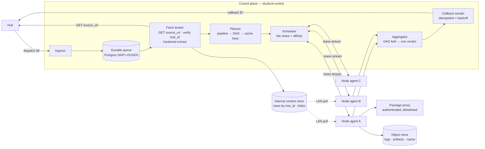

# Drydock — a high-performance CI runner service for Hull

**Status:** draft design (multi-tenant revision) · **Conforms to:** `CI-SPEC.md` contract v1 (rev. with
§9.1 + §14) · **Author:** design draft, not yet built

*Drydock* is a placeholder name (keel → hull → drydock); swap it if something better lands.

> **Section-reference convention.** A bare `§n` is a section of **`CI-SPEC.md`** — so `§14` is the
> spec's security section, `§9.1` its test-independence rule, `§7` its callback contract. A section of
> *this* document is written **`D§n`** (`D§6.3` = the cache design, `D§14` = the test plan). The two
> numbering spaces overlap and both are cited constantly; without the prefix, "§14" is genuinely
> ambiguous. Older cross-references in the body may still use bare `§n` for this doc — read those in
> context, and prefer `D§n` in new text.

---

## 0. What this is

A standalone, **multi-tenant** CI system that speaks Hull's two-call contract (`CI-SPEC.md`) and,
behind that contract, runs a **central orchestrator + fleet of execution nodes**. One Drydock instance
services **many Hull tenants at once**. The control plane owns queueing, scheduling, caching decisions,
source fetching, and the verdict; **nodes own all execution** — sandbox, run, stream logs. No user
code ever executes on the control plane.

Hull deliberately owns none of this (§1: "Hull is a dispatcher, not a scheduler"), so everything below
is ours to design. The fixed points are: accept a dispatch and return 2xx fast; fetch source **only**
from `source_url` as a keel tree tar, never git (§6); run it under the normative isolation rules
(§14); and eventually POST one `{status, summary}` to `callback_url`.

Two theses, one performance and one security, and they are in tension:

- **CI latency is dominated by work we already did and by bytes we already have.** Hull memoizes whole
  trees; Drydock's job is to memoize *below* that granularity and to schedule so the bytes are already
  on the machine that runs the job.
- **In a fleet serving many tenants, every job is untrusted relative to every other tenant.** §14
  assumes every job is hostile to the *platform*; multi-tenancy adds that it is hostile to every other
  *tenant* too. So sharing — the thing that makes the first thesis fast — is exactly the thing the
  second thesis must fence. Every shared surface (the content store, caches, a node, the scheduler) is
  a potential cross-tenant channel, and the design's spine is: **share for speed within a tenant/trust
  tier, never across one.** Multi-tenancy is therefore not a feature bolted on late — it is the frame
  the whole design is built inside (§1, threaded throughout).

---

## 1. Goals, targets, and the multi-tenant frame

### Goals

1. **Multi-tenant and hostile-by-default.** One instance serves many tenants; every job is untrusted
   relative to the platform *and* to every other tenant. §14 is not advice, it is the design's frame:
   the microVM tier is the **default** path (§7.2), single-use sandboxes, no credentials near a job,
   egress denied, and **no shared surface ever crosses a tenant or trust-tier boundary** (store, cache,
   node, scheduler — the "Multi-tenancy" subsection below and the threat model there).
2. **Conform to contract v1** exactly — including the `errored`/`red` discipline (§7), the
   content-addressed tar fetch (§6), and every MUST in §14.
3. **Central ↔ node split.** Orchestrator is small and restartable; nodes are the muscle and are
   individually disposable.
4. **Exploit content addressing.** keel gives every tree and subtree a content address for free.
   Step-level cache keys should be a metadata computation, not a filesystem walk.
5. **Fast, in this order:** step memo hit (no run) → tree already on node (CoW workspace) → tree in
   our internal store (LAN fetch) → cold fetch from Hull.
6. **Fair across tenants.** Throughput is shared capacity; no tenant's flood starves another's click.
   Weighted fair queueing and per-tenant quotas are a central mechanism, not a footnote (§4.5).
7. **Horizontally boring.** Add nodes → more throughput, no reconfiguration. Nodes dial out; no
   inbound ports, so spot/edge/on-prem capacity all work.

### Non-goals (v1)

- Deployment/CD. Drydock produces verdicts, not releases.
- A general workflow engine. The pipeline format stays declarative and small.
- **Platform credentials in jobs.** The CI shared secret, cloud roles, and Hull's source auth never
  reach a sandbox — that stays structurally absent (§14.2). *Tenant-declared* secrets **are**
  supported (D§7.4/D6) for **`member`-authored** jobs, and never to a fork PR.
- **Secrets to an `outsider`.** A fork-PR / unknown-contributor job gets no tenant secrets at all; that
  is a security boundary, not a limitation to fix. Note this is gated on **author class, not isolation
  tier** (D§1) — a member's job on the hosted fleet does get its secrets, in a microVM.
- Replacing Hull's built-in local runner. That stays the zero-config single-tenant path (and §14's
  closing note is explicit that it is not safe for untrusted input).

### Performance targets (p50 / p99, held as SLOs)

| Path | Target |
|---|---|
| Dispatch → 2xx ack | 15 ms / 60 ms |
| Dispatch → first step executing — **tree already on node** | 300 ms / 1.5 s |
| Dispatch → first step executing — **tree in internal store, not on node** | 2 s / 6 s |
| Dispatch → first step executing — **fully cold (fetch from Hull)** | 5 s / 20 s |
| Tree fetch + verify + extract, 500 MB / 100k files, from internal store | 1.5 s / 4 s |
| Workspace instantiation from a node-cached tree (CoW snapshot) | 50 ms / 200 ms |
| Sandbox spawn — container tier, warm pool | 40 ms / 200 ms |
| Sandbox spawn — microVM tier, snapshot restore | 150 ms / 600 ms |
| Final step done → callback delivered | 100 ms / 1 s |
| Control-plane throughput, single instance | 5 000 dispatches/min |
| **Fairness: a tenant at 100% of its quota raises another tenant's dispatch→first-step p99 by** | ≤ 10% |

The 300 ms / 5 s spread between warm and cold is the entire argument for affinity scheduling (§5.2),
the internal content store (§4.2), and warm pools (§6.4). The fairness row is the multi-tenant SLO: it
is what "weighted fair queueing" (D§4.5) has to *buy*. It is measured, per the harness in D§14, by
pinning one tenant at its cap and watching a second tenant's start-latency histogram not move.

### Multi-tenancy — the design pillar

A *tenant* is a Hull tenant (`tenant/repo` and its owning org); a single Drydock instance serves many
of them. Orthogonal to tenancy are **two further axes that must not be conflated** — an earlier draft
used one word, `trust`, for both, and the collision made tenant secrets and the shared cache
unreachable on the very configuration the product ships as:

| Axis | Values | Answers | Set by |
|---|---|---|---|
| **Isolation tier** (D§7.2) | `microvm` \| `container` | *How strong is the box this code runs in?* | Platform policy. On any multi-tenant instance this is **always `microvm`** — never negotiable, never author-influenced. |
| **Author class** (this section) | `member` \| `outsider` | *Whose authority does this code carry?* | Derived from the dispatch's `author` and the repo's membership — a **fact about the actor**, never anything the pipeline can assert. |

A **member** is a principal of the tenant with write access to the repo — their code could be pushed
to the default branch anyway, so withholding a cache or a secret from it protects nothing. An
**outsider** is a fork PR or an unknown contributor: code the tenant has not vouched for.

The two axes are genuinely independent, and the important case is the one the old vocabulary could not
express: **a member's job on the hosted fleet runs in a microVM *and* may write the shared cache and
receive tenant secrets.** Strong box, full authority. An outsider's job runs in an identically strong
box with neither. Isolation is a property of the *sandbox*; cache-write and secret access are
properties of the *actor*. Conflating them either weakens the box for members or strips members of
capabilities they already have by other means — both wrong.

This is the same boundary GitHub draws (a member's branch push gets secrets; a fork's `pull_request`
does not), with the isolation question decoupled so the fleet can run *everything* in a microVM
without that choice silently revoking anyone's rights.

All three axes — tenant × isolation tier × author class — partition every shared surface below.

**The isolation model in one line:** the **microVM is the isolation unit, not the host.** An untrusted
job is a single-use Firecracker microVM with a hardware-virtualization boundary; two *different*
tenants' untrusted microVMs may sit on the same host for the same reason AWS Lambda packs thousands of
unrelated tenants' microVMs per server — the boundary is KVM, not a shared kernel ([AWS Open Source
Blog, "Firecracker," 2018](https://aws.amazon.com/blogs/opensource/firecracker-open-source-secure-fast-microvm-serverless/):
<5 MiB overhead/microVM, 1 000 microVMs/host demonstrated; [NSDI'20](https://www.usenix.org/conference/nsdi20/presentation/agache):
oversubscription used to 10× in production). This is what makes multi-tenancy affordable: we get
density *and* a hard boundary. The **trusted/container tier is the exception** — its boundary is a
shared host kernel, which is strong against the platform but *not* strong enough to co-locate two
tenants — so trusted-tier nodes are **single-tenant** (a single-operator convenience, §7.2), never a
shared-fleet path.

**Node partitioning (the decision).** Nodes carry a `tier` label and are **hard-partitioned by trust
tier**: an untrusted-pool node never runs a trusted-tier job and vice-versa (a trusted container next
to an untrusted container would put a tenant's real work behind a shared-kernel boundary from a fork
PR — unacceptable). *Within the untrusted pool*, tenants co-reside freely because the microVM is the
boundary. *Trusted-pool* nodes are single-tenant. A tenant who wants hardware-level separation even
from other tenants' *microVMs* (regulatory, or paranoid-by-budget) buys a **dedicated pool**: nodes
labelled to its tenant id, scheduler-fenced, at the cost of losing cross-tenant bin-packing. So the
model is: **hard partition by tier (always); soft co-residency within the untrusted tier (default);
dedicated pools by tenant (opt-in).** This is deliberately *not* "one node per tenant for everyone" —
that forfeits the density that makes the economics work, to defend against a channel (microVM escape +
same-host side-channel) that the hardware boundary already addresses.

**The multi-tenant threat model.** A tenant's job is hostile to the platform (§14) *and* to every
other tenant. Each shared surface is a potential cross-tenant channel; each gets a named control:

| Cross-tenant channel | The leak | Control | Where |
|---|---|---|---|
| **Shared blob store / dedup** | Cross-tenant dedup is a *file-existence oracle*: "does blob X already exist" confirms another tenant has that file | Dedup is **within-tenant only**; cross-tenant dedup **off by default** (D7), and never timing-observable when on | §4.2 |
| **Shared build cache** | Poisoned entry, or reading another tenant's cache | Namespace `(tenant, scope, trust_tier, path)`; **never crosses tenants — no opt-in exists**; sharing *within* a tenant is an opt-in named scope with admin-granted write access; tier access is read-down/write-own so untrusted never writes what trusted reads; entries content-verified on read | §6.3 |
| **Shared node (co-residency)** | Escape from A's job into B's job on the same host; same-host side-channel (cache-timing, Spectre-class) | microVM hardware boundary is the isolation unit; untrusted co-residency is microVM↔microVM; trusted tier single-tenant; dedicated pools for hard separation | §7.2 |
| **Timing / existence oracle** | Cache-hit vs miss latency reveals whether *another* tenant built the same input | Every cache/memo/affinity key is tenant-scoped, so a cross-tenant hit is structurally impossible — there is nothing to time | §6.1, §6.3 |
| **Log / summary bleed** | One tenant's output surfaces in another's logs or summary | Logs keyed `tenant/repo/tree_id/step`; object-store ACLs per tenant; summary constructed only from *this* job's output (§6.6); callback carries the tenant's own secret | §6.6, §11 |
| **Secret bleed** | Tenant A's secret reaches B's job, or the platform | Per-tenant KEK envelope encryption; JIT delivery scoped to the one job; **never to an `outsider`-authored job** (gate is author class, not isolation tier); masked in output | §7.4 |
| **Scheduler side-channel** | Queue depth / placement timing leaks another tenant's load | Fair-queue accounting is per-tenant; a tenant sees only its own queue; placement jitter (§5.2); no shared queue-position signal | §4.5, §5.2 |
| **Noisy neighbour** | A saturates CPU/IO/disk/queue and degrades B | Per-tenant concurrency + node-minute quotas (admission); per-job cgroup limits; weighted fair queueing | §4.5, §7.2 |

The through-line: **isolation is on every axis (tenant × trust-tier), and it is structural, not
scrubbed.** Where a control could be "filter it out," the design prefers "there is nothing to filter"
— tenant-scoped keys, per-tenant KEKs, single-use microVMs. The rest of the doc is where each row is
built; this table is the index and the audit checklist reads against it (§9).

---

## 2. Fit against the spec — what the revision changed, and four remaining gaps

The revised spec **resolved the biggest gap in the previous draft of this design.** Source fetch is
now keel-native and content-addressed (`source_url` → tree tar, git explicitly non-conforming), which
is strictly better than the `git_url` + `ref` clone it replaced: the fetch is verifiable
(re-hash to `tree_id`), infinitely cacheable, and free of git's ref/pack machinery. Two consequences
ripple through this design — no bare mirrors, no incremental fetch (§2.1), and a fetch broker rather
than per-node clones (§4.2).

§14 (security) and §9.1 (test independence) are also new and both change the design materially: §14
tightens isolation into a set of MUSTs (§7, §9), and §9.1 roughly doubles dispatch volume for
test-touching changes while playing directly to step-level memoization's strength (§8).

### 2.1 Five gaps

| # | Gap | Workaround today | Proposal |
|---|---|---|---|
| G1 | **No delta fetch.** `source_url` is whole-tree-or-nothing, and §6 makes it "the *only* fetch path." A one-line change to a 500 MB tree costs a 500 MB transfer on any node that doesn't already hold it. git's incremental fetch — the thing we gave up — was good at exactly this. | Fetch once into an internal content-addressed store, then serve nodes over LAN and cache per node (§4.2, §6.2). Absorbs it inside our fleet; the Hull→Drydock hop still pays full size on every new tree. | Additive, still content-addressed: `GET source_url?since=<tree_id>` returning only differing blobs, or a `…/tree/<id>/manifest` + per-blob fetch so the client asks for what it lacks. Either is a pure addition (§13) and turns cold fetch from O(tree) into O(diff). **This is the highest-value spec change available.** |
| G2 | **Private repos have no auth story.** §6 defers it; §14.2 already assumes the eventual shape ("single-use, source-scoped token"). Hosted needs it on day one. | Network identity between Drydock and Hull. Fine for one operator, wrong for hosted. | Ship the reserved token now: `fetch_token` + expiry in the dispatch, scoped to this `tree_id`. Consumed by the fetch broker only — §14.2 forbids it entering the sandbox, and our architecture never lets it. |
| G3 | **No cancellation.** A superseded change, a closed PR, or a verdict reached elsewhere leaves us burning node-minutes on dead work. §9.1 makes this worse: independence-tree jobs are exactly the kind that get invalidated. | Internal supersede only — a newer dispatch for the same lineage cancels older in-flight jobs; jobs self-cancel at their own timeout. | `POST <ci endpoint>/cancel {change, tree_id, reason}`, called by Hull on invalidation. Additive on both sides. |
| G5 | **Archive verification is a MAY (§6), but Hull caches the result forever.** A conforming runner that skips the re-hash can attach one tree's verdict to another tree's code, and the memo is keyed by `tree_id`. Demonstrated, not theorised: served a different tree's bytes under an advertised `tree_id` and `scripts/fake-ci.py` runs it and reports `green`. It also let Hull's own archiver ship unverifiable tars (followed symlinks) unnoticed until a verifying runner existed. | Drydock verifies unconditionally and treats a mismatch as `errored` — the D§4.2 broker makes it mandatory regardless of what the spec requires of others. | Promote to MUST, with `errored`-not-`red` on mismatch. Exact wording in §15/G5. **Cheap to comply with** — the ids are already content addresses. |
| G4 | **One verdict, no link, and `errored` is overloaded.** `{status, summary}` gives one sentence and nowhere to click. Worse: §9.1 now assigns **divergent meaning** to `errored` — "no tests" means *self_attested*, but "our node died" means nothing of the sort, and Hull cannot tell them apart. | Encode the distinction in `summary` prose and accept that Hull reads both as escalate-to-human. That direction is fail-safe (escalation, never auto-approval), so it is survivable. | Two optional additive callback fields: `details_url` (log view) and `reason` (`no_tests` \| `timeout` \| `infra` \| `capacity`). Hull's `ci_result` currently reads only `status`/`summary` and drops the rest, so both need a small Hull-side change to persist and render. |

### 2.2 Two places the spec contradicts or under-specifies itself

Worth resolving in the spec text, because a reader implementing it literally gets stuck:

**(a) Who fetches?** §6 says runners "SHOULD fetch and extract inside the isolated sandbox, not on the
control-plane host." §14.2 says "fetch `source_url` and post the callback **from the control plane / a
broker**, not from inside the sandbox." Taken literally these are opposites. The reconciliation both
are reaching for is a **third place** — a broker that is neither the sandbox nor the credential-holding
control host. That is what §4.2 builds. Suggested spec edit: make §6 say "fetch in a broker that holds
no ambient credentials and extract into the sandbox's workspace," and drop the apparent conflict.

**(b) §14.1 arguably outlaws build caches.** "A sandbox **MUST NOT** be reused across jobs. Destroy the
whole microVM/rootfs after each job so nothing (a planted binary, **a poisoned cache**, a lingering
process) survives into the next job." Read strictly, a persistent `~/.cargo` or `target/` cache is
state surviving into the next job — and a CI system without one is not a fast CI system. The
distinction the clause wants is *sandbox* reuse (never) versus *cache* reuse (necessary, but only
under rules). Suggested addition:

> A runner **MAY** persist a build cache across jobs provided that: (a) cache entries are written only
> by jobs whose tree is authored by a trusted principal, **or** are content-addressed and re-verified
> on read; (b) cache namespaces never cross tenants or trust tiers; and (c) the cache is mounted
> **read-only** into any job not permitted to write it. The sandbox itself MUST still be single-use.

Drydock implements exactly that rule (§6.3) — I'd rather the spec bless it than have every performant
runner be quietly non-conforming.

**(c) §14.2 reads as "no secrets," but means "no *platform* secret."** The clause forbids "the
`X-Hull-CI-Secret`, cloud keys, registry tokens, or `source_url` auth" in the job environment — all of
which are credentials the *platform* holds. A tenant's own declared secret (an integration-test API
key, a private-registry token they chose to set) is a different thing, and a CI system that can't
accept one is a toy. Suggested refinement: keep the absolute prohibition on platform-held credentials,
and add that a runner **MAY** inject **tenant-declared** secrets into a job **only** when the job is
authored by a principal the tenant vouches for — never a fork PR or unknown contributor, **independent
of which isolation tier the job runs in** — the values are **registered for redaction** in captured
output, and they never touch the control host's request path or a node's disk. Drydock implements
exactly this (§7.4).

**Note the wording: "registered for redaction", not "masked".** An earlier draft of this clause said
the value is "masked in all captured output", which is a guarantee no implementation can honour —
redaction is exact-substring matching, and `base64`, splitting across two writes, or any encoding
defeats it. Writing it as a MUST would put a promise in the spec that a one-line shell pipeline
falsifies, and a normative clause that is routinely violated teaches readers to skim the normative
clauses. The author-class gate is what actually protects a secret from hostile code — redaction only
stops an accidental `echo` by code that was not trying.

---

## 3. Architecture



**Control plane** — `drydock-control`, Rust + axum (same stack as Hull; can share `hull-plugin` types
directly). Replicas are interchangeable; durable state lives in Postgres + object storage. In-memory
state (node roster, warm sketches) rebuilds from heartbeats within one interval, so a replica can be
killed at any time.

**Fetch broker** — the answer to §2.2(a). A separate, hardened process (own container, own uid, no
cloud role, no CI secret, egress restricted to Hull) that GETs `source_url`, verifies the archive
re-hashes to `tree_id` (§5 permits it; we make it mandatory), extracts with a paranoid tar reader, and
writes the tree into the internal content store. It never runs job code and holds nothing a job could
want.

**Node** — `drydock-node`, Rust, one per machine. Owns local disk, the tree cache, the sandbox pool,
and the cache daemon. Dials out; needs no inbound connectivity.

**Why Rust for both:** the node needs cgroup v2, namespaces, seccomp, microVM control, and CoW
filesystem operations with nothing between it and the syscalls; the control plane wants Hull's
`keel-store` / `hull-plugin` types without a serialization boundary. Same argument Hull already made.

---

## 4. Control plane

### 4.1 Ingest — ack fast, durably

```
POST /hull   (the configured CI endpoint)
  1. constant-time compare X-Hull-CI-Secret        → 401 on mismatch
  2. reject unknown X-Hull-CI-Version major        → 400
  3. INSERT job ON CONFLICT (repo, tree_id) DO NOTHING     ← idempotency, §9
  4. 202 {"accepted": true, "job_id": "..."}
```

The ack returns only after the row commits — an ack means "durably ours." Everything after is
asynchronous. One indexed insert comfortably meets 15 ms p50.

Idempotency key is `(repo, tree_id)`, matching the spec's advice. A duplicate dispatch for a live tree
attaches to the existing job and receives the same verdict; a duplicate for a finished job re-sends the
recorded verdict (cheap, and it heals lost callbacks).

### 4.2 Fetch broker and the internal content store

This is the component the revised §6 forces, and it turns out to be the right shape anyway.

```
fetch(tree_id, source_url):
    if store.has(tree_id): return                    # content-addressed ⇒ always safe to skip
    stream GET source_url                            # broker's own network identity (+ G2 token later)
    → bounded: max archive bytes, max entries, max path depth, max single-file size
    → hardened tar extraction:
        reject absolute paths, "..", symlinks escaping root, hardlinks, device nodes,
        setuid/setgid bits, duplicate entries, and paths differing only by unicode normalization
    verify: re-hash extracted tree → MUST equal tree_id, else abort → errored
    store.put(tree_id, tree)                          # dedup at blob level, within tenant*
```

Three things this buys:

1. **The Hull→Drydock hop happens once per tree**, not once per node. Without it, a 12-way sharded
   test step would pull the same 500 MB tar twelve times over the internet.
2. **Blob-level dedup** inside the store makes the *internal* transfer incremental even though the
   external one isn't (G1's workaround): a node holding tree `A` pulls only the blobs of tree `B` it
   lacks. We rebuild the delta protocol on our side of the wire.
3. **Tar parsing — the classic attack surface — happens in exactly one hardened place**, not on every
   node. That extraction runs on attacker-controlled bytes; concentrating it is worth real effort.

\* Blob dedup is *within a tenant* by default (D7, and the "shared blob store" row of the §1 threat
table). The store is therefore keyed `(tenant, blob_hash)`, so blobs are never shared across tenants
even when identical. Cross-tenant dedup is a storage win and a confirmed-file-existence oracle; keep it
off unless an operator explicitly accepts that trade, and even then never let dedup be observable
through fetch timing (serve a "miss" at the same cost whether or not another tenant holds the blob).

**Store format, dedup granularity, and GC.** The store is two maps, exactly the split Bazel's remote
CAS and git's object model both use: an **action/tree map** (`tree_id → manifest`, where a manifest is
the list of `(path, mode, blob_hash)`) over a **blob map** (`(tenant, blob_hash) → bytes`). Dedup
granularity is **whole-file** — the same choice as git loose objects, Bazel CAS, and the Nix store —
which is simple, gives content-addressed verify-on-read for free, and captures the dominant CI case
(a one-line edit changes one file's blob, everything else is shared). Chunk-level content-defined
chunking (the restic/borg rolling-hash approach) would dedup *within* a large file too, but it's not
worth the complexity until a profile shows big, slightly-mutated binaries dominating; whole-file is the
default (D-note: revisit if large-artifact repos appear). Because content addresses are immutable the
store needs **no invalidation, only GC**, and GC must be **reference-aware, not naive LRU**: a blob is
live if any retained tree's manifest names it. So GC is mark-sweep from tree roots (Nix's model —
[Nix manual, garbage collection](https://nix.dev/manual/nix/latest/package-management/garbage-collector)) with
tree roots themselves evicted LRU under a disk watermark and a floor for trees referenced in the last
hour. Evicting a tree drops only the blobs no surviving tree still references — LRU on *trees*,
refcount/mark-sweep on *blobs*.

### 4.3 Job & step model

```
job    (id, repo, change, tree_id, callback_url, secret_ref, state, priority,
        trust_tier, created_at, deadline_at, verdict, summary, reason, details_url)
step   (id, job_id, name, state, cache_key, node_id, lease_expires_at,
        attempt, exit_code, started_at, finished_at, log_object_key)
edge   (job_id, from_step, to_step)
```

Job: `queued → fetching → planning → running → {green | red | errored} → reported`.
Step: `pending → ready → leased → running → {passed | failed | errored | cached | skipped}`.

`reported` is separate from the verdict so the callback sender retries independently of job
completion, and so a duplicate dispatch can re-report without re-running.

### 4.4 Planning — pipelines as hermetic code, not YAML

The pipeline is read out of the extracted tree **in the broker's store** — no separate Hull API call,
no clone, and the bytes are already verified against `tree_id`.

The format is **Starlark**, not YAML (§12/D5). Starlark reads like Python — functions, `for` loops,
computed values — so a build matrix or a shard list is expressed once instead of copy-pasted. Crucially
it is **hermetic**: no filesystem, no network, no clock, no `while`/unbounded recursion, deterministic,
and guaranteed to terminate. That property is load-bearing, not a nicety: the pipeline is
attacker-controlled and is **evaluated on the control plane** to produce the DAG, and §14.1 forbids
running job code there. Starlark is safe to evaluate for exactly the reason a general-purpose language
SDK (Dagger-style) is not — and evaluating an SDK in a sandbox would drag a spawn into the plan step of
*every* job, forfeiting the sub-second cached verdict the design exists for. `starlark-rust` (the Buck2
implementation) drops into `drydock-control` directly.

```python
# .hull/ci.star
image("rust:1.83")            # OCI ref, resolved to a digest at plan time
trust("trusted")              # "trusted" | "untrusted" → isolation tier (§7.2)
cache_scope("acme-rust")      # share this tenant's cache across repos (§6.3); default = this repo

rust = ["crates/**", "Cargo.toml", "Cargo.lock"]

step("fmt",   run = "cargo fmt --check", inputs = ["**/*.rs", "rustfmt.toml"])
build = step("build", run = "cargo build --workspace --all-targets",
             inputs = rust, cache = ["target/", "~/.cargo/registry"])
step("test",  run = "cargo test --workspace", needs = [build],
             inputs = rust, shard = "auto", timeout = "20m",     # shard by history (§6.5)
             secrets = ["TEST_DB_URL"])                          # tenant secret, trusted-only (§7.4)
action("scan", uses = "hull/secret-scan")                       # built-in action, no user shell
```

**The module surface (complete).** Five builtins, nothing else; evaluating the file just **records a
DAG** — the functions have no side effects, and `run` strings are opaque data executed **inside the
sandbox only**, never on a node host, never on control, never in the broker.

| Builtin | Signature | Returns | Validation |
|---|---|---|---|
| `image` | `image(ref)` — default OCI ref, resolved to a digest at plan time | `None` | `ref` 1..512 chars |
| `trust` | `trust(tier)` — requests an **isolation tier** only: `"trusted"`(=container) \| `"untrusted"`(=microVM). A *request*, clamped upward by policy and never downward; the multi-tenant floor is `"untrusted"`, so on the fleet this builtin is inert. **It cannot touch author class** (D§1) — no pipeline can grant itself cache-write or secret access | `None` | tier ∈ enum; effective tier = `max(policy_floor(author_class), request)` |
| `cache_scope` | `cache_scope(name)` — the named cache scope this repo's `cache` paths resolve to, **within this tenant** (§6.3). Default: this repo. A pipeline may *name* a scope; **write access is an admin grant on the tenant**, so referencing a scope this repo may not write yields read-only access, not an error | `None` | `name` 1..64, `[A-Za-z0-9_-]`; resolved against the tenant, never another tenant's |
| `step` | `step(name, run=None, inputs=[], cache=[], secrets=[], needs=[], shard=None, timeout=None, image=None, continue_on_error=False)` | handle (the name) | `name` 1..64, `[A-Za-z0-9_/-]`, unique; every `needs` must reference an **already-declared** step; `shard` ∈ `"auto"` \| int 1..256 |
| `action` | `action(name, uses, needs=[])` — a built-in action implemented in the node binary, **no user shell** | handle | as `step`; `uses` names a registered action |

`step`/`action` return the step's name as a **handle**, so `needs = [build]` is just data flow;
because a `needs` target must already exist, the DAG is **acyclic by construction** and dangling edges
are impossible. Field types: `run`/`timeout`/`shard`/`image` are strings; `inputs`/`cache`/`secrets`
are string lists (globs, cache paths, secret names); `needs` is a list of handles; `continue_on_error`
is a bool. The emitted DAG is the same declarative shape a YAML file would have produced, so nothing
downstream (§6 memoization, §8) changes — only the authoring surface does.

**Evaluation bounds**: a max **step budget** / emitted-node count and a max **DAG depth**, so a
pathological-but-valid module can't wedge the planner; plus starlark-rust's own call-stack cap. No
`load()`, no file/URL fetch, and no `open`/network/clock builtins exist in the dialect — the
billion-laughs / remote-reference class the YAML parser had to fence out is simply *absent*, not
filtered. Assert that absence as an **inventory** (a golden assertion over the complete set of global
names), not as a blocklist, so a future starlark release that adds a global fails a test instead of
quietly widening the surface.

> **Correction — the bounds above are not sufficient, and the reason generalizes.** Every one of them
> bounds *evaluation*. Roughly **800 nested brackets — about 1.6 KB of source — overflows the stack
> inside `AstModule::parse`, before any of them exists to be consulted.** A Rust stack overflow is not
> an error you catch; it aborts the process. That is a **remote crash of the control plane from a file
> in an untrusted tree**, which is the one thing D§4.4 exists to prevent. Raising the stack does not
> fix it: measured, 20k brackets still aborts a dedicated 128 MiB stack with `SIGABRT`.
>
> Parsing therefore needs its own **pre-parse bound** — a byte scan, before the parser sees anything,
> capping bracket nesting, tokens per statement, and indentation. Brackets alone are not enough:
> `x = ---…-1` and `x = 1+1+1+…` reach a deep AST with no brackets at all, and a parenthesised
> continuation defeats any per-*line* cap. Evaluation should also run on a **dedicated thread with a
> measured stack**, which additionally contains starlark-rust's heap limit being only periodically
> checked — a bomb that allocates inside one call sails past it and *panics* rather than erroring.
>
> **The lesson, stated generally, because it is not specific to Starlark:** "hermetic, deterministic,
> and guaranteed to terminate" is a claim about *evaluating* a program. It says nothing whatever about
> *parsing* one. Any design that accepts attacker-controlled config on a trusted host has to make its
> safety argument about the parser as well as the interpreter — and the parser is the part that runs
> first, on the rawest input, usually in someone else's code.

> **Prototyped (measured — I ran it).** In a throwaway crate against `starlark` 0.14, a ~250-line
> evaluator implementing exactly the four builtins above ran the example `.hull/ci.star` and emitted
> the expected 7-node DAG **including three `clippy-*` steps generated by a top-level `for` loop** — the
> code-as-config win, confirmed. A 12-probe suite then passed 12/12: `while` rejected (not in the
> dialect), `load()`/`open()`/`fetch()`/`time.now()` all rejected (no such builtins → hermeticity is
> structural), unbounded recursion terminates via the stack cap rather than hanging, the step budget
> trips, and duplicate names / dangling `needs` / bad `trust` / bad `shard` are all rejected by the
> validation above. **One real finding that changes the spec of the evaluator:** standard Starlark
> *forbids top-level `for`/`if`* (`for cannot be used outside def`), so computed fan-out at module
> scope requires enabling `enable_top_level_stmt` on the dialect (`enable_load` stays **off**). Without
> that flag the headline "express a matrix once" ergonomics don't work; with it, they do, and the
> hermeticity/termination properties are unaffected. The prototype has been deleted; this is what it
> proved.

No `.hull/ci.star`? Fall back to autodetect matching Hull's built-in runner (`Cargo.toml → cargo test`,
`package.json → npm test`, `go.mod → go test`, `Makefile` with a `test` target → `make test`) so
pointing a repo at Drydock doesn't change behavior. Nothing detectable → `errored` with
`reason: no_tests` — which §9.1 reads as *self_attested*, so the distinction matters (G4).

### 4.5 Queue, fair-share, and admission — the multi-tenant scheduler's core

The queue is where fairness lives, so it is a central mechanism, not a footnote. Storage is Postgres
`FOR UPDATE SKIP LOCKED` over ready steps — one dependency, transactional with job state, good to ~10k
steps/sec, well past need; NATS JetStream is the escape hatch, deliberately not day one. What sits on
top of it is the fairness machinery.

**Weighted fair queueing across tenants (virtual-time / WFQ).** Each ready step carries a *virtual
finish time* `vft = vft_last(tenant) + cost / weight(tenant)`, and the scheduler always dispatches the
smallest `vft`. `cost` is estimated node-seconds (historical p50 for that `step_key`, else a default);
`weight(tenant)` comes from the tenant's Hull plan. The effect: capacity is divided in proportion to
weight, and — critically — **a tenant that floods the queue only advances its *own* virtual clock**, so
its 10 000 queued steps drain at its share while a neighbour's single interactive step, with a small
`vft`, jumps ahead. This is the classic WFQ guarantee (a backlogged flow gets exactly its weighted
share, no more) applied to tenants instead of packets. A tenant idle for a while is *not* allowed to
bank unlimited credit: `vft_last` is clamped to `max(vft_last, now_virtual − ε)` so a returning tenant
starts near the current virtual time rather than starving everyone to catch up.

**Within a tenant:** priority classes — `interactive` (an actor clicked check; someone is watching a
spinner) preempts `background` (merge-queue, nightly, **and independence-tree jobs**, §8) — then FIFO.
Priority reorders *within* a tenant's share; it never lets a tenant exceed that share, so priority is
not a fairness bypass.

**Admission control (per-tenant quotas from the plan).** Two caps, both from the tenant's Hull plan:
**concurrent running steps** and **node-minutes per rolling hour**. A step is *admitted* to running
only if both are under cap; otherwise it stays queued (it still holds its `vft` position). Over cap is
a **wait, not a failure** — a plan limit is a queue, and Drydock surfaces the wait in the summary.
Only when a step exceeds the **queue-wait timeout** (§10.2, default 30 min) does it become `errored`
with `reason: capacity` — never `red`, because the code didn't fail, the tenant ran out of plan.

**Noisy-neighbour protection is layered:** WFQ bounds a tenant's *scheduling* share; admission bounds
its *concurrent footprint*; per-job cgroups (§7.2) bound a single job's CPU/mem/IO/PID so one job
can't wreck the node it lands on; and the node-partition model (§1) keeps a tenant's untrusted work
inside microVM boundaries. Each layer defends a different resource; together they are the "a tenant at
100% of quota moves a neighbour's p99 by ≤10%" SLO (§1).

---

## 5. Scheduling

### 5.1 The node roster

Every node holds one long-lived stream to a control replica and heartbeats every 5 s:

```
NodeState {
  node_id, labels: {arch, os, gpu, region, tier}, capacity: {slots_total, slots_free},
  load: {cpu, mem, disk_free, io_pressure},
  warm: {
    trees:  [tree_id…],                                  // bounded, LRU
    caches: cuckoo_filter(step_keys + cache-mount digests) // few KB, false-positive only
  }
}
```

A compact filter, not a list. **Sizing (cuckoo filter, Fan et al., CoNEXT 2014).** False-positive rate
is ε ≈ 2b/2^f for bucket size b and fingerprint bits f
([Cuckoo Filter paper](https://www.cs.cmu.edu/~dga/papers/cuckoo-conext2014.pdf)). At the standard
b = 4 slots/bucket the table packs to ~95% load, so cost is ≈ f/0.95 bits per key. For a **0.1%** FPR,
f = ⌈log₂(8/0.001)⌉ = 13 bits → ~1.7 bytes/key; **10k cache keys ≈ 17 KB**, and the doc's "few KB"
holds ~1–2k. A Bloom filter at the same 0.1% costs ~14.4 bits/key (comparable) **but cannot delete** —
and cache entries get evicted, so the cuckoo filter's deletion support is why it wins here, not the
handful of bits. Because a false positive is harmless (one mis-routed job that then does a normal store
pull) we can even run a *looser* ε to pack more keys; false negatives are impossible, which is the
correct error direction. A 1000-node fleet is single-digit MB per 5 s heartbeat cycle into control's
memory either way.

### 5.2 Placement

Candidates = label match ∧ **trust-tier partition** ∧ **tenant-pool match** ∧ `slots_free > 0` ∧ not
draining. The partition is a hard filter, not a score: an untrusted step is only ever a candidate for
untrusted-pool nodes, a trusted step for the (single-tenant) trusted pool, and a step from a tenant
with a dedicated pool only for that pool's nodes (§1). Affinity scoring runs *inside* the surviving
candidate set, so it can never pull a job across a tenant or tier boundary for the sake of a warm
cache. The `cache_affinity` term reads a **tenant-scoped** cuckoo filter (§5.1) — keys are
`(tenant, tier, step_key)` — so a cache hit is structurally impossible to observe across tenants, which
is the "timing/existence oracle" control in the §1 table.

```
score(node, step) =
      3.0 · tree_affinity     // node already holds this tree_id
    + 2.0 · blob_affinity     // node holds most of this tree's blobs (a near-sibling tree)
    + 2.0 · cache_affinity    // node's filter hits this step's cache mounts
    + 1.0 · (1 − normalized_load)
    − 1.5 · queue_depth_at_node
    + jitter(0.15)            // break hotspots
```

`blob_affinity` is new since the fetch change and matters more than it looks: §9.1 independence trees
and ordinary rebases produce trees that are *nearly* identical to one the node already holds, so exact
`tree_affinity` misses while blob overlap is ~99%. Scoring both is what keeps those jobs on the warm
path.

**Cold-start locality:** rendezvous (HRW) hashing on `(tenant, repo, step_name)` gives each step a
stable home node even with zero warm information, so a cold fleet converges to locality instead of
smearing every repo across every node. HRW ranks nodes by `hash(key, node_id)` and picks the max
([Thaler & Ravishankar, "Using Name-Based Mappings to Increase Hit Rates," IEEE/ACM ToN 1998](https://www.microsoft.com/en-us/research/wp-content/uploads/2017/02/HRW98.pdf)):
its property is **minimal disruption** — adding or removing one node in a fleet of *n* remaps only ~1/*n*
of keys, and every other key keeps its home, so autoscaling (§12) doesn't scatter warm state the way a
plain `hash % n` would. It's O(*n*) per lookup, trivial at fleet size. Overflow to the next-highest-ranked
node when the top choice is full, bounded so one busy repo can't pin a node. The `tenant` in the key
keeps different tenants' identically-named steps on independent home nodes (no cross-tenant collision).

### 5.3 Leases

Assignment is a **lease**, not fire-and-forget:

```
lease = (step_id, node_id, expires_at = now + 30s)
node renews every 10s while running; control extends
missed renewal → lease expires → step back to ready, attempt += 1
attempt > 3 → step errored (reason: infra, "lost node ×3")
```

A dead node costs at most 30 s of dead air and no operator action. A partitioned node finds its lease
revoked on reconnect and drops the work: the control-plane lease record is authoritative, so a step is
never *counted* twice even if it *ran* twice — which the single-use sandbox rule makes harmless anyway.

---

## 6. The performance story

Six mechanisms, roughly in payoff order.

### 6.1 Three layers of "don't run it again"

| Layer | Owner | Key | Effect |
|---|---|---|---|
| 1. Tree memo | **Hull** (exists) | `tree_id` | Identical tree never dispatched at all |
| 2. Step memo | drydock-control | `step_key` (below) | Rebase, doc-only edit, unrelated-crate change, **or an independence tree** skips most steps |
| 3. Action cache | Node cache daemon | compiler/tool level (sccache, cargo, npm) | Incremental cost *within* a step that does run |

Layer 2 is the new one and the reason this design exists:

```
step_key = H( pipeline_version, step_def_canonical, image_digest,
              subtree_digest(inputs_glob) …,          ← from keel, no file hashing
              env_allowlist_values,
              author_class, isolation_tier,           ← added: see (1) below
              step_key(each dependency) )
```

> **Six corrections, all found by implementing this.** The formula and the rules around it were wrong
> in ways that only appear when something has to serve an answer from them.
>
> 1. **`author_class` and `isolation_tier` were missing, and their absence is exploitable.** A
>    `member`'s `passed` is not evidence about an `outsider`'s run of a byte-identical step: the
>    outsider gets no tenant secrets (§7.4) and different cache authority (§6.3), so serving the hit
>    **skips the step that would have failed**. Both are hashed in.
> 2. **The design never said which state a cached *failure* takes, and the obvious reading is a green
>    build.** `fold` counts `cached` as a pass, so marking a remembered failure `cached` turns a red
>    job green. It must be served as **`failed`**. This was the worst bug available in this layer, and
>    it was available only because a state was left unspecified.
> 3. **`subtree_digest(inputs)` is unsound on its own.** A glob that matches nothing folds an empty
>    set — *the same digest on every tree that has ever existed*. That is the "no inputs" hazard
>    wearing a plausible `inputs` list, so "selected nothing" is a second explicit refusal alongside
>    "declared nothing". An empty directory counts too: its address is a constant.
> 4. **Memoizing `(tree_id, glob) → digest` reintroduces the oracle §1 closes.** It is the right
>    optimisation — trees are immutable — but a cross-tenant hit is a cheap "has anyone else built
>    this tree" probe. Key it `(tenant, tree_id, glob)`.
> 5. **Chaining was stated in one direction only.** A changed dependency invalidating its dependents
>    is here; an *unkeyable* dependency making its dependents unkeyable is not, and is required —
>    guessing past it caches a step against inputs nobody accounted for.
> 6. **"No file hashing" is true of a digest but not of the first walk of a tree.** On a keel object
>    store the ids already exist; from an extracted tarball somebody must walk it once. The honest
>    claim is that the broker *retains what verification already computed*, which costs ~4% over
>    verifying and discarding.

`subtree_digest` resolves a path glob to keel content addresses **without ever hashing file contents** —
keel's `Tree` is a Merkle node (`TreeEntry { name, mode, id }`), so a directory entry's `id` *is* that
subtree's content address, already computed. That is the property step-level memoization rests on, and
it is why this is affordable on a content-addressed substrate and painful on a git-shaped one.

**Verified against `keel-store`, with one correction to the earlier claim.** Cost depends on the glob's
shape, and the difference is worth designing around:

- A **directory-prefix** glob (`crates/**`) is an O(depth) descent — a handful of object reads, and the
  answer is a single existing `ObjectId`. Genuinely a metadata lookup.
- A **pattern** glob (`**/*.rs`) is **not**. No single subtree corresponds to it, so it requires walking
  the tree's node structure and folding the matching blob ids into a digest. That is O(entries), not
  O(1) — on a 100k-file repo, milliseconds of structure traversal, not the "microseconds" an earlier
  draft claimed. Still far from the *seconds* of content hashing a non-content-addressed CI pays, so
  the economics hold; the mechanism is just less magical than stated.

**Now measured, on 100k files × 1 KiB (102,203 entries), release build:**

| | |
|---|---|
| index the tree (walk + hash, structure retained) | **7.38 s** |
| the same walk, discarding the structure (plain verification) | 7.11 s — so retaining it costs **~4%**, once per tree |
| `crates/**` (prefix glob) | **464 ns** |
| `**/*.rs` (pattern glob, 100k matched) | **23.9 ms** (~240 ns/entry) |
| a real 67k-entry `node_modules`, pattern glob | 10.3 ms |

Two consequences, and the first is larger than it reads: **prefer directory-prefix `inputs`** in
`.hull/ci.star` — that is a **~51,000× difference**, not a stylistic preference, and the linter §8 asks
for should say so in those terms. And **memoize `(tenant, tree_id, glob) → digest`**, sound because
trees are immutable, so a repeated glob on a repeated tree is a map hit — tenant-scoped for the reason
in correction (4) above.

A step whose `step_key` has a recorded `passed` result is marked `cached` and never dispatched. If
every step is cached, the job resolves without touching a node and the callback goes out in
milliseconds — a second-order memo *underneath* Hull's tree memo.

**Only `passed` results are cached long-lived.** `failed` is cached briefly (it's real signal, and a
repeat shouldn't rerun the world); `errored` is never cached — mirroring §7's discipline one level
down, for the same reason: an outage must not poison anything.

### 6.2 Materialize, don't fetch

Node workspace lifecycle, post-spec-change:

1. **Tree cache** — extracted trees, keyed by `tree_id`, on a CoW filesystem, LRU by disk watermark.
2. **Pull-on-miss from the internal content store** (§4.2) over LAN, blob-level, so a near-sibling tree
   transfers only its differing blobs.
3. **Job workspace** = CoW snapshot of the cached tree. ~50 ms regardless of tree size. This is
   *simpler* than the git-era design it replaces: no fetch, no checkout, no ref resolution — snapshot
   an immutable tree and go.
4. **Teardown** = drop the snapshot. O(1); no `rm -rf` of 100k files, and it satisfies §14.1's
   "destroy the rootfs" cleanly.

The cached tree is immutable and never mounted writable, so the snapshot is also the isolation
boundary for the source: a job can scribble all over its workspace and the cached tree is untouched.

**CoW mechanics per filesystem (D3).** Two shapes, picked by tier. For the **trusted/container** tier
the workspace is a filesystem snapshot: **btrfs** `subvolume snapshot` is an O(1) metadata reflink of
the cached tree's subvolume — new writes allocate fresh extents, unchanged files stay shared — which is
why instantiation is ~50 ms independent of tree size and teardown is a single subvolume delete
([btrfs subvolume/snapshot docs](https://btrfs.readthedocs.io/en/latest/Subvolumes.html)). **overlayfs**
is the fallback where the filesystem isn't ours to choose: a read-only `lowerdir` (the cached tree) +
per-job `upperdir`/`workdir`, with writes triggering a whole-file **copy-up** into the upper layer
([kernel overlayfs docs](https://docs.kernel.org/filesystems/overlayfs.html)) — cheap to set up but the
copy-up cost is paid per modified file, so a build that rewrites large files is slower than btrfs's
extent sharing. We default to **btrfs** on nodes we own (cheap snapshots, no ZFS ARC memory tax) and
overlayfs elsewhere. For the **untrusted/Firecracker** tier the workspace is a **virtio-blk** device
(§7.2), so the CoW is at the *image* level: a reflinked copy of a raw block image (btrfs/XFS reflink),
or a qcow2 overlay with the cached tree as backing file — same O(1)-snapshot / drop-on-teardown
property, one level down.

### 6.3 Cache mounts — and the §14.1 rule

Declared `cache:` paths mount into the sandbox as an overlay: shared read-only lower layer from the
node's cache daemon + a writable upper layer per job. On a passing step the upper layer is promoted
into the shared cache; on failure it's discarded.

Governed by the rule proposed to the spec in §2.2(b):

**Namespace = `(tenant, scope, author_class, cache_path)`.**

Note the third element is **author class, not isolation tier** (D§1). Who may write a cache is a
question about the actor's authority, not about the strength of the sandbox — which is why a member's
job on the hosted fleet is a cache writer despite running in exactly the same microVM as a fork PR.

- **The tenant is the hard boundary. A cache is never shared across tenants, ever** — no
  configuration, no opt-in, no operator flag. This is the one line in the cache design with no
  exceptions, because a cache read is an execution primitive: whoever writes an entry chooses code
  that later runs in the reader's sandbox.
- **`scope` is where sharing happens, and it is *within* a tenant.** It defaults to the repo id, so
  out of the box a repo's cache is its own. A tenant may define **named scopes** so repos under the
  same org share one cache — the intended shape being a base scope populated by one repo (a warmed
  `~/.cargo/registry`, a shared `node_modules` store, an sccache bucket) that its siblings read. Sharing
  is **opt-in and named**, never implicit-by-path: two repos in an org both declaring `target/` are
  different artifacts built by different toolchains, and silently unioning them by path would be a
  correctness bug before it was a security one.
- **A scope name is a tenant-level grant, not a string a pipeline can claim.** `.hull/ci.star` may
  *reference* a scope, but write access to a shared scope is configured by the tenant's admins against
  the repo. Otherwise any repo in the org — including the org's least-guarded one — could nominate
  itself as the writer of a scope every other repo reads, which is org-wide cache poisoning with extra
  steps.

**Read-down, write-own (this is the rule that was previously stated as a contradiction).** Author class
partitions the layers *within* a scope, and access across them is deliberately asymmetric:

- **`member`-authored jobs read and write the scope's shared layer**, on a passing step. This is the
  layer that actually gets populated, and on a multi-tenant fleet it is the *only* one — which is the
  whole point of keying on author class: under the old tier-keyed rule nothing on the fleet could ever
  write a cache, so D§6 layer-3 was dead on the default path.
- **`outsider`-authored jobs read that shared layer and write only a throwaway upper layer** destroyed
  with the job. A fork PR gets the speed benefit of the org's warm cache and cannot leave a trace in it.

There is deliberately **no shared outsider layer.** One could exist — fork PRs would then cache for
each other — but it would be poisonable by any fork PR for every later fork PR, to accelerate the rarer
path. Throwaway-only is the better default; revisit only with evidence that fork-PR builds are a
material share of the fleet.

So the boundary is **one-way, not sealed**: authority flows down into the sandbox, writes never flow
back up. That is the "poisoned cache" §14.1 names, closed by direction rather than by scanning. (The
earlier text asserted both "never crosses trust tiers" and "untrusted jobs read the trusted lower
layer," which cannot both hold.)

- Where the tool supports it (sccache, npm integrity, cargo `.crate` hashes), entries are
  content-addressed and **re-verified on read**, so a corrupt entry fails closed rather than silently
  building the wrong thing. On a shared scope this is not optional decoration — it is what keeps one
  repo's bad write from becoming another repo's wrong build.

Cache promotion is a node-local operation on a passing step only; a red or errored step promotes
nothing.

**The blast radius this buys, stated honestly.** Widening the default from per-repo to a shared
per-tenant scope widens the poisoning surface from one repo to every repo that reads that scope. That
is a real trade, not a free win, and it is the tenant's to make: cross-tenant remains impossible, but
*within* an org, a shared scope means trusting every writer of that scope as much as the most sensitive
repo that reads it. Three things keep it bounded — sharing is opt-in, write access is an admin grant
rather than a self-declared string, and entries are content-verified on read where the tool allows.
Operators who want none of it simply never define a shared scope, and every repo keeps its own.

### 6.4 Warm pools — and why they still conform

Each node keeps N pre-booted sandboxes per hot image digest: containers unpacked, microVMs snapshot-
restored, workspace mount point empty and waiting. Starting a job is then "bind the workspace and
exec," not "pull an image and boot."

**This is not sandbox reuse.** A pool member has never run a job; it is handed to exactly one job and
destroyed afterward. §14.1's prohibition is on *reuse across jobs*, and nothing here is reused —
pre-warming is to sandbox lifetime what pre-heating an oven is to cooking two meals in it. (Worth one
sentence in the spec to make that unambiguous, since the naive reading of "single-use" can be misread
as "cold-start every time," which would cost 10× on start latency for no security gain.)

Pool size is demand-predicted per node from the last hour's image mix, floor 1 for any image seen in
24 h, capped by memory pressure. The memory cap is real and dominated by *guest RAM*, not VMM
overhead: Firecracker's per-microVM overhead is <5 MiB
([AWS](https://aws.amazon.com/blogs/opensource/firecracker-open-source-secure-fast-microvm-serverless/)),
so a warm pool member costs ~its configured guest RAM resident — pool depth ≈ `free_RAM /
guest_RAM_per_job`, and snapshots are kept small precisely so this ratio (and the restore latency,
§7.2) stays favourable.

### 6.5 Fan-out and sharding

Independent DAG steps run on *different nodes* simultaneously — a 4-step pipeline with one dependency
edge is 2 steps deep in wall clock, not 4. `shard: auto` splits a test step into K shards using
recorded per-test timings, bin-packed to equalize duration (LPT — simple, within 4/3 of optimal,
entirely adequate). K is chosen so each shard lands near a target duration (default 90 s) rather than
being a fixed number, because fixed shard counts get pathological as suites grow.

Sharding is also where §4.2's store earns its keep: 12 shards on 12 nodes means 12 workspace snapshots
of a tree pulled once over the internet.

Fold: all shards pass → step passes; any fails → step fails, and the failing shard's log is what the
summary points at.

### 6.6 Fail fast, report once

One verdict is allowed, so the aggregator reaches it as early as it legitimately can:

- First `failed` step not marked `continue_on_error` → **cancel in-flight siblings** (leases revoked,
  sandboxes destroyed) and report `red`. No reason to finish a build whose verdict is determined.
- All steps `passed`/`cached` → `green`.
- Any step `errored` while none failed → **`errored`**, never red, with a `reason` (G4).

Summaries are built from **untrusted job output** (§14.5), so they are constructed, not concatenated:
control characters stripped, ANSI removed, unicode normalized, test names length-capped and quoted,
total length capped at 200 chars. Nothing from a job is ever interpolated into a field name or a URL.

```
green:   "18 steps (14 cached), 1240 tests, 0 failed — 47s"
red:     "test/shard-3 failed: 2 of 1240 tests — `auth::token::expiry`, `auth::token::refresh` — 61s"
errored: "node lost 3× on step `build` — no verdict produced"
```

---

## 7. Nodes

### 7.1 Node agent

Single Rust binary, supervised:

- **Control link** — one multiplexed bidirectional stream, outbound only. gRPC/HTTP2 or QUIC (§12/D1;
  QUIC recommended, since keel already brings the stack and node links are long-lived over imperfect
  networks). Reconnect with backoff + jitter; a reconnect inside the lease TTL resumes rather than
  restarts.
- **Executor pool** — one slot per CPU group (default 2 cores + 4 GB, declared in node config).
- **Tree cache** (§6.2) and **cache daemon** (§6.3), both LRU-bounded by disk watermark.
- **Log shipper** — line-oriented, batched to object storage, **hard-capped** per §14.4 (default 50 MB
  / 500k lines per step; beyond it, truncate with a marker and keep the tail). A job must not be able
  to OOM or bankrupt us by printing.

The agent runs as an unprivileged user. It holds **no tenant credentials and no CI shared secret** —
neither the fetch path nor the callback path goes through it (§14.2), and there is nothing in its
memory a successful sandbox escape would want except the ability to be a node.

### 7.2 Isolation tiers (§14.1 is normative here)

> **Naming.** This section's `untrusted` / `trusted` tiers are the **isolation** axis only —
> read them as `microvm` / `container` (D§1). They say how strong the box is, and nothing about whose
> authority the code carries. Cache-write rights (D§6.3) and secret access (D§7.4) key on the
> *separate* **author class** axis (`member` / `outsider`), so a member's job on the fleet is in the
> `microvm` tier *and* fully privileged. The tier names below are kept because §14.1's normative text
> uses them; the two axes are what matter.

| Tier | Mechanism | For | Warm spawn |
|---|---|---|---|
| **untrusted** (the default, and the whole multi-tenant fleet) | Firecracker microVM restored from snapshot; workspace as a **virtio-blk** device (see note); no shared host kernel | fork PRs, unknown authors, **every job on a multi-tenant instance**, anything not explicitly marked otherwise | ~150 ms (researched, with caveats below) |
| **trusted** (the narrow single-tenant exception) | Locked-down OCI container: user namespace + cgroup v2 (cpu/mem/pids/io) + default-deny seccomp + **read-only rootfs** + tmpfs `/tmp` + all capabilities dropped + `no-new-privileges` | first-party repos on a **single-tenant** operator's own instance where every author is trusted | ~40 ms |

Both tiers are **single-use**: one job, then the rootfs/microVM is destroyed (§14.1). The tier comes
from `trust:` in the pipeline, **clamped by platform policy** — a tenant may raise the tier but never
lower it below what the author class requires, and on a multi-tenant instance the floor is `untrusted`
so `trusted` is simply unreachable there. `trusted` is the *single-tenant operator's* opt-in, turned
on knowingly for a box where every author is trusted; it is emphatically **not** a fleet path, because
a shared host kernel is not a boundary you can put between two tenants (§1, node partitioning).

**Why untrusted-default is mandatory now, not deferred.** The previous draft treated the microVM tier
as an M4 concern and let M1 take untrusted input on a container. In a fleet serving many tenants that
is backwards: *every* job is untrusted relative to the other tenants, so the microVM tier is the
product, and the container tier is a bring-up scaffold (§13) plus a single-tenant convenience. Tenant
isolation and the Firecracker tier therefore move **early** in the milestones, not last.

**Node partitioning (recap of §1).** Nodes are hard-partitioned by `tier` label; untrusted tenants
co-reside within the untrusted pool (microVM boundary); trusted nodes are single-tenant; dedicated
per-tenant pools are opt-in. The scheduler's candidate filter enforces it (§5.2).

> **Researched, not measured** (no `/dev/kvm` on this host — macOS; numbers are from literature, not a
> Drydock benchmark). Two corrections to the naïve table:
>
> - **Firecracker has no virtio-fs.** It exposes only ~5 virtio devices (net, block, vsock, balloon,
>   rng) — no virtio-fs, no arbitrary passthrough
>   ([Firecracker discussion #4845](https://github.com/firecracker-microvm/firecracker/discussions/4845)).
>   So the workspace is a **virtio-blk block image** of the extracted tree, not a shared-directory
>   mount. That actually suits us: we snapshot an immutable tree (§6.2) into a block device and attach
>   it read-through, and virtio-blk out-performs virtio-fs/9p for the many-small-files build tree
>   anyway ([Kata storage benchmarks](https://github.com/kata-containers/runtime/issues/2138)). virtio-fs
>   would only matter on a Cloud-Hypervisor/QEMU backend, which we don't default to.
> - **~150 ms is real only with lazy restore.** The clean sub-10 ms "snapshot restore" figures in the
>   literature are the *VMM + device-state* restore only
>   ([Catalyzer/REAP](https://marioskogias.github.io/docs/reap.pdf): ~50 ms VMM restore). The rest is
>   guest memory faulting in on demand, which **scales with working-set size**: REAP measured ~182 ms
>   of first-run page faults; ATC'24 SnapStart showed a **2 GB guest eager-restores in ~7 s but <100 ms
>   with userfaultfd on-demand restore** ([Pang et al., ATC'24](https://www.usenix.org/conference/atc24/presentation/pang)).
>   So the ~150 ms target holds **only** if we (a) use userfaultfd lazy restore, (b) keep the snapshot's
>   RAM small, and (c) prefetch the stable working set (REAP's technique: 1.04–9.7× faster first run).
>   We should quote it as a *range* and hold p99 with the working-set prefetch, not present 150 ms as a
>   floor. Firecracker's docs give no ms figure and warn restore cost "depends on memory size, vCPU
>   count and device count" and to use cgroups **v2**
>   ([snapshot docs](https://github.com/firecracker-microvm/firecracker/blob/main/docs/snapshotting/snapshot-support.md)).

**No raw shell on any host, ever** — matching Hull's stated CI rule. The node binary never interpolates
user strings into a host command line; `run:` is passed as argv into the sandbox.

**The backend is a trait** (`spawn → exec → collect → destroy`, plus a capability query for what §14
controls it can actually enforce). Two implementations: **Firecracker** (untrusted — the default and
the fleet), and the **locked-down container** (the trusted tier, and the M1 bring-up backend — §13). A
backend that cannot enforce §14.3 egress-deny reports so, and the scheduler refuses to place untrusted
work on it — the conformance gap is a property the code knows about, not a comment in a doc. **gVisor
was considered and set aside** for the untrusted tier: its filesystem/syscall path is the worst case
for build toolchains (HotCloud'19 measured the fastest gVisor config ~2.8× slower than native, and
Gofer-mediated file ops far worse — [Young et al.](https://www.usenix.org/system/files/hotcloud19-paper-young.pdf)),
and its syscall-emulation gaps risk breaking arbitrary compilers. **Cloud Hypervisor** stays the
fallback backend where a job needs a device Firecracker lacks (GPU/PCIe passthrough, live migration).
A hosted-VM backend (Box) was evaluated and rejected — §12.1.

### 7.3 Network (§14.3)

- **Default egress-deny**, enforced in the sandbox's netns with nftables.
- **Cloud metadata endpoints blackholed unconditionally** — `169.254.169.254`, `fd00:ec2::254`, and
  the link-local range generally. This is the classic RCE→instance-role escalation and §14.2 calls it
  out by name; it is denied at the netns *and* the node's own firewall, belt and braces.
- Where dependency resolution needs the network, the only reachable destination is the **package
  proxy** (§7.4) — never the open internet, never Hull, never the internal content store, never other
  nodes.
- No inbound network to the sandbox.

### 7.4 Credentials — no *platform* secret in a job; *tenant* secrets under rules

§14.2 forbids the CI secret, cloud keys, registry tokens, and source auth in the job environment. That
absolute still holds for everything the *platform* owns. But a CI system users can't hand a secret to
is a toy, so Drydock separates the two (§12/D6, §2.2(c)): platform credentials are structurally absent
as before; tenant-declared secrets are supported, but only where they're safe.

**Platform credentials — structurally absent:**

- **Source** arrives as an already-fetched, already-verified tree mounted into the workspace. The job
  never fetches, so it never needs fetch auth — §14.2 satisfied structurally, not by scrubbing.
- **Callback** is sent by the control plane; the CI shared secret exists only there.
- **The node holds no cloud role and no CI secret.** A sandbox escape finds nothing but the ability to
  be a node.

**Tenant-declared secrets — the secret broker (D6).** A fourth credential-scoped process, sibling to
the fetch broker and package proxy. Its job: store tenant secrets encrypted, and hand exactly one
job's declared secrets to exactly the node running that job, at exec time, for `member`-authored jobs
only (D§1 author class — *not* isolation tier).

*Storage — envelope encryption with per-tenant KEKs.* Each secret value is sealed with a fresh
**DEK**; the DEK is wrapped by that **tenant's KEK**; the KEK's root lives in a KMS/HSM (AWS KMS, GCP
Cloud KMS, or Vault transit) and **never leaves it** — the universal envelope pattern
([GCP KMS envelope docs](https://docs.cloud.google.com/kms/docs/envelope-encryption),
[AWS KMS client-side encryption](https://docs.aws.amazon.com/kms/latest/cryptographic-details/client-side-encryption.html)).
**One KEK per tenant** is the unit of tenancy: it gives single-API-call **crypto-shredding** of a
whole tenant (delete the KEK → all its DEKs, and thus all its secrets, are unrecoverable) and hard
blast-radius isolation — "a compromise of one tenant's key does not affect any other tenant"
([WorkOS, cryptographic key isolation](https://workos.com/blog/cryptographic-key-isolation-multi-tenant-saas)).
Ciphertext lives in the control-plane DB; **plaintext never touches Hull's request path and never
lands on a node's disk.**

*Delivery — attestation, then a job-scoped, single-use grant.* A step declares needs by name
(`secrets = ["NPM_TOKEN"]`). At placement, control mints a **short-TTL, single-use capability** bound
to `(job_id, node_id, [declared secret names], author_class=member)` — the response-wrapping /
SVID-style pattern where a reference, not the secret, travels and any interception is detectable
([Vault response-wrapping](https://developer.hashicorp.com/vault/docs/concepts/response-wrapping);
[SPIFFE/SPIRE workload attestation](https://spiffe.io/docs/latest/spiffe-about/spiffe-concepts/)). The
node presents it plus its own Ed25519 node identity (below); the broker verifies the node is the
lease-holder, that requested names ⊆ the job's declared set, and that the author class is `member`, then
returns just those values. The node injects them as env vars into the single-use sandbox and holds
them in memory **only for the spawn** — never written to disk, gone when the microVM is destroyed.

> **Node binding is only as strong as the thing that authenticates the node, and that is a separate
> component.** The broker binds a capability to a `node_id` and refuses a redemption presenting a
> different one — but a `node_id` is just a string in a request. Unless the transport has already
> proven *which node* is speaking, the field is self-asserted and the `WrongNode` refusal is
> decorative: an attacker who has the capability token can simply claim the right id.
>
> So the binding is load-bearing **only** when the server seam verifies the node's Ed25519 identity
> (§7.4's enrolment keypair) on the connection carrying the redemption, and derives `node_id` from
> that verified identity rather than from the request body. Stated explicitly because the failure is
> invisible: the code reads as though it enforces node binding either way, the tests pass either way,
> and the control silently does nothing until the identity check exists. **Until then, treat the
> capability token itself as the only real authenticator** — which is why it is single-use,
> short-TTL, and scoped to one job's declared names, none of which depend on the node's claim.
>
> The same applies to the lease-holder check: "the broker verifies the node is the lease-holder"
> requires the lease table, which lives in the control plane, not the broker. Both checks belong at
> the seam where identity is already established, and the design should not imply the broker can do
> them alone.

*Rotation & revocation.* KEKs rotate by **versioning**: a new KEK version wraps new DEKs while old
versions still unwrap existing ones, so rotation re-wraps small DEKs and **never re-encrypts the
secrets themselves** ([AWS KMS rotation](https://docs.aws.amazon.com/kms/latest/developerguide/rotate-keys.html)).
Revocation is primarily **short TTLs that auto-expire** (the capability above), with two break-glass
paths: revoke an outstanding capability, or crypto-shred a whole tenant by deleting its KEK.

- **Never to an outsider.** An `outsider`-authored job (fork PR, unknown contributor — D§1) is passed
  no secret names and the broker refuses to mint a capability for it. **The gate is author class, not
  isolation tier** — a member's job on the hosted fleet runs in a microVM and still gets its secrets,
  because the microVM is how strong the box is, not a statement about whose authority the code carries.
  Keying this on isolation tier (as an earlier draft did) meant no job on a multi-tenant instance could
  ever hold a secret, making D6 "yes" in name and "no" in practice.
  This is exactly the boundary GitHub draws (secrets are not provided to a fork's `pull_request`
  workflow), and the trap it warns about — `pull_request_target` running untrusted code *with* secrets
  in scope, the "pwn request"
  ([GitHub Security Lab](https://securitylab.github.com/resources/github-actions-preventing-pwn-requests/))
  — is one Drydock cannot fall into, because author class is **derived from the dispatch's `author` and
  repo membership** and *clamps the broker*. Nothing the pipeline author writes can raise it: a fork PR
  that edits `.hull/ci.star` to request secrets is refused at the broker, which never consulted the
  pipeline in the first place.
- **Masking is a backstop, not a control.** Every value registers with the log shipper (§7.1) and the
  summary constructor (§6.6) and is replaced with `***`. But log masking is exact-substring redaction
  and is **trivially evaded** by base64/split/transform — GitHub says as much: redaction "relies on
  finding an exact match" and structured/encoded secrets slip through
  ([GitHub secure-use](https://docs.github.com/en/actions/reference/security/secure-use)). So masking
  stops an accidental `echo`; it is *not* what protects a secret from hostile code. The real control
  is the trust-tier gate above — hostile (untrusted) code never receives the secret in the first place.
- This is also how **private base images and private package registries** work: the pull/proxy
  credential is just a tenant secret, so the job gets its dependencies without ever seeing it.

**Package auth still terminates at the proxy** where it can: the proxy holds upstream registry
credentials and authenticates outbound; the job talks to it over a per-job URL with a per-job bearer
that grants nothing but "resolve packages for this job, at this rate limit."

> **Five corrections, from building the proxy against the broker.**
>
> 1. **`use` is authority, not just disclosure — and this section frames the whole gate around
>    disclosure.** "Hostile code never receives the value" reads as though terminating auth at the
>    proxy sidesteps the author-class question. It does not; it converts a disclosure into a **confused
>    deputy**. A fork PR that can make the proxy fetch `@acme/private-lib` on the tenant's token has
>    pulled that package into a build it controls and can read out of its own workspace. No token
>    crosses the sandbox boundary and the tenant is robbed anyway. **So the `member`-only gate binds
>    the proxy too**, per-upstream rather than per-job, so ordinary fork PRs still resolve public
>    registries.
> 2. **This section names no principal for the proxy.** "The proxy holds upstream registry
>    credentials" is written as though it simply *has* them, next to a paragraph insisting a tenant
>    secret only ever moves as a capability to an authenticated principal. Both cannot be true unless
>    the proxy **is** a principal — so it gets the same Ed25519 enrolment keypair as a node, and its id
>    is derived from a verified signature rather than read off a request.
> 3. **The node-binding warning above applies verbatim to the proxy, and is worse there.** A node is
>    one machine; a proxy is *one process serving every tenant on the fleet*, so "the credential
>    belongs to the tenant whose job asked" is not a consequence of topology the way it is for a node.
>    It has to be checked explicitly, at every layer that could get it wrong.
> 4. **"Short-TTL" cannot be one number.** Placement→exec is short and known; package resolution
>    happens at an unknown point inside a job. A proxy capability's expiry has to come from the job's
>    grant, which is genuinely weaker than a node capability's 60 seconds and should be stated as such
>    rather than averaged away.
> 5. **"Plaintext never lands on a node's disk" is scoped to the wrong component.** The proxy is not a
>    node. The invariant that actually holds — and the one worth writing — is *plaintext never lands on
>    disk anywhere*, and at the proxy it is bounded by a **job** rather than by a spawn.

**Environment is otherwise allowlist-only** — `PATH`, `HOME`, `LANG`, `CI=true`, declared non-secret
pipeline vars, plus the injected tenant secrets. Everything else is dropped, not filtered, so an added
host variable can't leak by default.

Node identity to control is a per-node Ed25519 keypair enrolled at provisioning — the same scheme Hull
already uses for actors, so node attestations can ride it later.

---

## 8. Test independence (§9.1) — what it means for us

Hull's independence-tree mechanism needs nothing from a runner: we receive an ordinary dispatch for an
ordinary `tree_id`. But it changes our load and plays to our strengths, and both are worth planning
for.

**Volume.** A change that touches tests produces **two dispatches** — the real tree and the composed
independence tree. On a codebase where most changes touch tests, that approaches 2× dispatch volume.
Capacity planning must assume it.

**These jobs are the best case for step memoization.** The independence tree is the change's code with
touched tests reverted to the parent's version — so it differs from the real tree *only in test files*.
Every step whose declared `inputs` exclude those test paths is a **layer-2 cache hit** (§6.1), and the
tree itself is a near-sibling of one a node likely holds, so `blob_affinity` (§5.2) keeps it warm. In
the common case the second dispatch costs only the test step. Getting `inputs` globs right in
`.hull/ci.star` is what unlocks this, which is an argument for shipping good defaults and a linter for
the pipeline file.

**Priority.** Independence jobs are verification-gating but not interactive — nobody is watching a
spinner. They belong in `background` so a flood of them can't delay a human's click (§4.5).

**Reporting honesty matters more here.** §9.1 gives `errored` a *specific* meaning on an independence
tree — "no pre-existing test exercises this change" → `self_attested` → human review. If we report
`errored` for an infra flake, Hull reads it as a statement about test coverage. It fails safe
(escalates rather than auto-approves), so this is not a correctness hole, but it *is* the strongest
argument for the `reason` field in G4: today the two are indistinguishable to Hull, and they mean
different things.

**We must never special-case it.** No detecting "this looks like an independence tree" and behaving
differently — that would defeat the guarantee. Composed trees are ordinary trees; the mechanism's
integrity depends on us not knowing the difference, and we structurally can't.

---

## 9. Conformance to §14, clause by clause

Because §14 is normative, here is the map — this doubles as the audit checklist.

| §14 clause | Where satisfied |
|---|---|
| 14.1 single-use, kernel/hardware-isolated sandbox | §7.2 — microVM default, locked-down container for the trusted single-tenant tier |
| 14.1 no sandbox reuse; destroy rootfs after each job | §7.2 + §6.2 (CoW snapshot dropped at teardown); warm pools are pre-boot, not reuse (§6.4) |
| 14.1 never execute job code on the control plane or a credential-holding host | §3 — control, broker, and node-agent host never run job code; jobs run only inside a sandbox |
| 14.2 scrub environment to an allowlist | §7.4 — allowlist-only, drop-by-default (allowlist includes the step's declared tenant secrets) |
| 14.2 no **platform** secret (CI secret / cloud keys / source auth) in the job | §7.4 — structurally absent; the job neither fetches nor calls back. **Tenant-declared** secrets are injected for **`member`-authored** jobs only (author class, not isolation tier — D§1) and masked in output — needs the §14.2 refinement in §2.2(c) to be strictly conforming |
| 14.2 block cloud metadata endpoint | §7.3 — blackholed at netns and node firewall |
| 14.2 fetch and callback from control plane / broker, not the sandbox | §4.2 broker fetches; §10.1 control sends the callback |
| 14.3 default egress-deny; authenticated package proxy only | §7.3 + §7.4 |
| 14.3 no inbound to sandbox | §7.3 |
| 14.4 non-root, read-only rootfs, tmpfs scratch | §7.2 |
| 14.4 drop capabilities, no-new-privileges, default-deny seccomp | §7.2 |
| 14.4 CPU/mem/PID/disk limits + wall-clock timeout → `errored` | §7.2 (cgroups) + §10.2 (timeouts) |
| 14.4 cap captured output | §7.1 — 50 MB / 500k lines, truncate-and-tail |
| 14.5 treat all job output as untrusted; sanitize `summary` | §6.6 — constructed, stripped, capped; never interpolated into fields or URLs |

Two additional controls beyond §14, both earned from the fetch change: hardened tar extraction against
path traversal / symlink escape / tar bombs (§4.2), and bounded Starlark evaluation of the pipeline (§4.4). Both
process attacker-controlled bytes *outside* a sandbox, which makes them the highest-value hardening in
the system.

**Beyond §14 — the multi-tenant conformance map.** §14 is written for a single hostile job against the
platform; it says nothing about job-vs-job across tenants, because that is Drydock's design surface,
not Hull's contract. The **cross-tenant threat table in §1** is the second half of this audit
checklist: each channel (shared cache, shared blob store, co-residency, timing/existence oracle,
log/summary bleed, secret bleed, scheduler side-channel, noisy neighbour) names its control and the
section that builds it, and §14's harness (below) tests each one as a fail-closed case. A runner can
pass every §14 clause above and still be a cross-tenant leak; both tables must be green.

**On Hull's accountability invariant:** Drydock is not an *authoring* actor — it emits a verdict, not a
change, comment, or review, so it needs no delegation chain rooted at a human. The moment triage
starts commenting or fixing (Hull M5/M6), those actions go through Hull's existing delegation scheme
and the human review gate: a Hull-side agent consuming Drydock's output, not a Drydock feature. Worth
keeping that boundary crisp.

---

## 10. Correctness and failure

### 10.1 Callback delivery

The one externally visible output, so it gets its own durable state and worker:

- Sent when the job reaches a terminal verdict; retried with exponential backoff + equal jitter,
  1 s → 5 min cap. **Note the arithmetic** (an earlier draft got this wrong and said "~12 attempts
  over ~1 h"): twelve attempts capped at five minutes span ≈ **23 min**, not an hour —
  `1+2+4+…+256` is ~8.5 min and each later attempt adds only the 5 min cap. Reaching an hour needs
  ~19 attempts, or a larger cap. Pick the *duration* you want to survive (a Hull restart? a deploy? an
  outage?) and derive the count from it, rather than quoting a count and assuming the duration.
- **Only retry what can succeed later.** 5xx / 408 / 429 are retried; a 400 or 401 is parked
  immediately. Retrying a refusal for twenty minutes only delays the alert a human needs to see, and
  a wrong shared secret does not become right by waiting.
- **Redirects are not followed.** The callback carries a bearer secret in a header; following a
  redirect would hand it to whatever host the redirect names.
- Uses `callback_url` **verbatim** (§5: opaque, never constructed), echoing `X-Hull-CI-Secret` (§8).
- Idempotent by construction — Hull re-affirms the same verdict, and §9 makes duplicate delivery
  explicitly safe.
- **Deduplicate the work, never the delivery.** This is a distinction an earlier draft did not draw,
  and the implementation shipped the bug the omission invited. Jobs are keyed `(repo, tree_id)`, but
  **two changes can share one tree** — a rebase, a cherry-pick, a revert of a revert; that sharing is
  the entire premise of tree-keyed memoization — and each arrives with its *own* `callback_url`.
  Treating the second dispatch as a pure duplicate and re-reporting to the *first* URL leaves the
  second change unverified forever, waiting on an answer that was delivered somewhere else. It is a
  silent failure: no error, no retry, no log line, nothing that looks broken enough to investigate.
  A job therefore accumulates the **distinct callback URLs** that have asked about it and the verdict
  fans out to all of them — de-duplicated by URL, so an ordinary retry of the same dispatch still
  delivers once, and one unreachable Hull does not suppress the others.
  This is reachable in normal operation precisely because §9 says Hull's in-flight de-dup is
  best-effort and in-memory: a second dispatch for a tree we already know is expected after a Hull
  restart, across replicas, or with `{"force": true}`. §9's own wording is the hint — be idempotent
  "per `(tree_id)` **or** per `callback_url`". **The tree keys the work; the callback keys the
  answer.**
- Exhausted retries → job parks in `report_failed` and **alerts**. §10 of the spec says an undelivered
  verdict just leaves the tree unverified, so no heroics are required — but silent non-delivery looks
  exactly like "CI is broken" to a user, so the alert is not optional.
- **Release every resource at the verdict, never at delivery.** The quota a job holds, its workspace,
  its place in the scheduler's accounting: all of it comes back the moment the verdict exists, while
  delivery is still retrying. This is what `reported` being a *separate state* from the verdict is
  for, and it is easy to write code that has the states and still gets the ordering wrong — the
  implementation did exactly that, awaiting delivery before retiring the job, so a single unreachable
  Hull held a tenant's whole concurrency allocation for the length of the retry budget (about an
  hour). The fleet idles, the next steps sit `ready`, and nothing in the logs explains it.

  Stated as a rule, because it is not specific to callbacks: **never hold a local resource across an
  operation whose duration is bounded by a remote party's availability.** Delivery is bookkeeping
  about telling someone the work is done; the work being done is what releases the resources.

  It is worth noticing *how* this was found. It was invisible while the default per-tenant quota (16)
  exceeded what the fleet could run (1), because sixteen simultaneously-undeliverable jobs are needed
  to wedge a tenant that way. Clamping the quota to real capacity — a tidiness fix, made for
  legibility — turned "needs sixteen coincidences" into "needs one", and the next conformance run
  deadlocked. **Making a system's numbers honest is a way of finding its bugs**, because a limit that
  cannot be reached also cannot be tested.

### 10.2 Timeouts

We must enforce our own (§10: Hull never times out):

| Scope | Default | On expiry |
|---|---|---|
| Step wall clock | 20 min (pipeline-overridable) | step `errored` → job `errored`, `reason: timeout` |
| Job wall clock | 60 min | cancel everything, `errored` |
| Queue wait | 30 min | `errored`, `reason: capacity` |
| Fetch | 5 min | `errored`, `reason: timeout` |

All report `errored`, never `red`. The code didn't fail; we did. (The fetch row said `reason: infra`
in an earlier draft, which was simply inconsistent — a clock that ran out is a `timeout` whichever
clock it was. `infra` is for a fetch that *failed*, not one that ran long.)

**A step killed by a signal is the case the table doesn't cover, and the memo key settles it.** A
wall-clock kill is ours, so `errored`. A `SIGSEGV` is the code's own doing, so `red`. **OOM is the
interesting one:** Hull memoizes by `tree_id`, so a verdict is only sound if it is a function of *the
tree alone*. An OOM kill depends on the node's memory limit — change the limit and the verdict changes
— so recording it as `red` would freeze a configuration-dependent answer against a content address,
permanently, and no later re-check would dislodge it. That makes OOM **`errored`**.

The rule generalizes, and is worth stating as the test for any future case: **if a verdict is not
reproducible from the tree alone, it is not memoizable, and therefore it is not `red`.**

### 10.3 Poison and flake handling

- A step that errors on ≥2 distinct nodes is marked **node-independent** and stops being retried;
  further attempts just burn capacity.
- A step that *fails* (red) is **not** retried by default. Auto-retrying red is how a CI system starts
  lying about flakiness. Opt-in per step (`retry: 2`), with the retry count surfaced in the summary so
  a flaky suite stays visible rather than laundered.
- Per-test flake tracking (same test, same tree, both outcomes observed) feeds a report, not a retry.
  Note that Hull's tree memo means a genuinely flaky tree gets its *first* verdict frozen — which is an
  argument for surfacing flake data prominently, since Hull will not rediscover it.

### 10.4 Verdict integrity

A step result is accepted only from the node currently **holding its lease**; a late result from an
expired lease is dropped. That is what makes "a step may run twice" harmless: it may run twice, but
exactly one run can ever be counted.

---

## 11. Observability

- **Metrics** (Prometheus): queue depth by tenant/priority; dispatch→start latency histogram split
  four ways (tree-on-node / store-hit / cold-fetch / memo-hit) — the single most important chart in
  the system; step duration by name; cache hit rate per layer; fetch bytes from Hull vs. from the
  internal store (the G1 cost, quantified); node slot utilization; lease-expiry rate; sandbox spawn
  time by tier; callback delivery latency and failures.
- **Tracing** (OTel): one trace per job — plan / fetch / queue-wait / placement / materialize / spawn /
  run / report. Job id propagated from the dispatch so a Hull-side trace can stitch to ours.
- **Logs:** object storage, keyed `tenant/repo/tree_id/step/attempt` (tenant-scoped and ACL'd per the
  §1 threat table's log-bleed row — the tenant prefix is structural, not cosmetic), retained per plan;
  live tail over the control link only while a viewer is attached.
- **Security telemetry** (new, because §14 is normative): seccomp denials, egress-deny hits, metadata
  endpoint attempts, tar-extraction rejections, sandbox-escape indicators. These are alerts, not
  dashboards — an egress-deny hit is a job doing something it shouldn't and is worth knowing about.
- **The one operator dashboard:** where is time going right now — queued / fetching / materializing /
  running / reporting, stacked. Mostly "fetching" → the internal store or affinity is misconfigured;
  mostly "queued" → we're short on capacity. Capacity decisions read off it.
- **Lead with what is *not* enforced.** The operator panel's first element is the list of §14 clauses
  this deployment does not satisfy (D§7.2's `unmet_clauses`). The most valuable thing an operator can
  know about a CI runner is not what it is doing but what it is not protecting against, and that fact
  is otherwise buried in a startup log nobody re-reads.

### 11.1 What building the panel exposed

Worth recording as a finding in its own right: **an observability surface is a test of the data
model**, and this one failed three times on first contact. None of these were visible from the code —
each became obvious the moment something had to *display* the state.

1. **There is no "delivering" state.** `report_attempts` is only written once every retry has
   finished, so a job that has decided but whose callback is being retried is indistinguishable from
   one that has never tried — for up to the full retry budget (§10.1). An operator watching a stuck
   deployment cannot tell "delivering, attempt 3 of 12" from "delivered nothing". The job state
   machine (§4.3) needs delivery to be observable *while it is happening*, not only after it stops.
2. **The scheduler cannot see the fleet it schedules for.** Admission control has per-tenant quotas
   but no knowledge of total capacity, so it can only *offer* work in fair order and take the fleet's
   refusal for an answer — it cannot hold a slot back from the wrong tenant. §4.5 assumed §5.1's node
   roster; until that roster exists, fair *ordering* is real and fair *allocation* is not. Displaying
   a null fleet capacity beside a node reporting its slots is what made the gap obvious.
3. **Default quotas exceeded deployable capacity by an order of magnitude** — a default plan
   permitting 16 concurrent steps on a deployment that can run one. Harmless in effect, but it means
   the number an operator reads is not a number that constrains anything, which is worse than having
   no number.

The general lesson: **a design is not finished until something has to render its state.** Prose can
describe a state machine that has no way to express a state anyone would want to look at.

---

## 12. Scaling, cost, and open decisions

**Scaling.** Control replicas are stateless behind a load balancer (Postgres primary + read replicas);
one replica meets the throughput target, run three for availability. The fetch broker scales
independently and is the natural place to hit an external bottleneck first. Nodes autoscale on queue
depth per label class; **scale-down must drain** (finish leases, refuse new) and should evict the
*coldest-cache* nodes — naive LIFO scale-down throws away exactly the warm state the scheduler depends
on. Spot capacity works (lease expiry already handles disappearance) but only for `background`
priority; interactive work goes on-demand so a human's click isn't at the mercy of a preemption.

**Cost lever ranking:** step memoization > blob-level dedup/affinity > spot > node sizing. The first
two reduce work; the rest make the same work cheaper.

### 12.1 Evaluated: Box (box.ascii.dev) as hosted isolation

[Box](https://box.ascii.dev/) is a hosted persistent-Linux-VM service for AI agents — CLI + HTTP API +
Python/TS SDKs, 4 vCPU / 8 GB / 50 GB at **$0.036/h** per-second billed, dedicated IPv4, 2 TB egress
included, EU-only (Germany, Finland, France), fork and resume in "a few seconds."

First, a framing correction: **Box *is* a full VM, and a VM is not overkill — §14.1 mandates one.** The
real axis is not VM-vs-container but *which VM*: a microVM (stripped, single-purpose, ~150 ms snapshot
restore, destroyed after one job) versus a full persistent Ubuntu VM with sudo, SSH, VS Code, Chrome,
and a 60 fps desktop. Box is emphatically the second.

**Rejected as the per-job sandbox**, for four reasons:

1. **Start-rate limits are fatal.** 600 starts/hour and 1 500 starts/day are hard platform ceilings
   regardless of plan; per-plan start rates run 10/min to 60/min. §14.1 forbids sandbox reuse, so one
   job is at least one start. A 12-way sharded test step is 13 starts ⇒ 1 500/day ≈ **115 jobs/day**,
   halved again by §9.1 independence trees to ~57 changes/day. Burst is worse: even at 60 starts/min,
   spawning 12 shards costs 12 s before a single test runs. §1 targets 5 000 dispatches/min.
2. **Latency is 10–20× off target.** "A few seconds" to fork, against §1's 40–150 ms warm spawn. Box
   does not claim the sub-500 ms VM-ready time its own comparison page credits to Daytona/E2B/Blaxel.
   A multi-second floor makes the sub-second fully-cached verdict (D§14) unreachable.
3. **No egress control outside the guest** — the §14.3 blocker. No documented firewall or egress
   policy, a public IPv4 per box, 2 TB egress included. Box's answer is that boxes "are full VMs with
   sudo, so you can add any controls you need inside them," which does not hold here: job code runs as
   root in that guest, and **a firewall the untrusted job can disable is not a control**. §14.3 and the
   §14.2 metadata blackhole must be enforced outside the boundary.
4. **Wrong shape.** Box optimizes for persistent, stateful, interactive agent VMs; CI wants ephemeral,
   headless, minimal. A 50 GB desktop image's boot time and attack surface bought for a `cargo test`.
   There is also no idle timer — billing counts from create/resume, not last activity — so a leaked box
   bills until stopped.

**Decision: deferred; Firecracker on owned/rented hardware is the path (D4/D9).** Box is not in the v1
plan, as a sandbox *or* as a node. Recorded here because the box-as-*node* idea is worth revisiting
later: run `drydock-node` inside a long-lived box hosting its own single-use Firecracker microVMs, so a
handful of boxes replace thousands of sandbox starts (the rate limits stop binding), the tree cache and
warm pools persist (§6 survives intact), and Box's disk-level fork provisions a node *from a snapshot
with the cache pre-baked*. That whole idea hinges on **nested KVM** — Firecracker needs `/dev/kvm`, and
Box documents Docker-in-box but says nothing about nested virt — and on it being not merely *present*
but *fast enough* (a Firecracker boot inside a box near the §1 ~150 ms target, not a multi-hundred-ms
nested-VM-exit tax). Cheap to answer when it matters (`box create` → `ls -la /dev/kvm` → time a
Firecracker boot), but out of scope now.

Two further flags if it's ever reconsidered for hosting: EU-only means 100–200 ms RTT to US/LatAm and
customer **source code residing with a third party**, and SOC 2 is stated as in progress.

| # | Open question | Recommendation |
|---|---|---|
| D1 | Node transport: gRPC/HTTP2 vs QUIC | **QUIC** — keel already brings the stack; node links are long-lived over imperfect networks where HOL blocking hurts. |
| D2 | Queue: Postgres SKIP LOCKED vs NATS | **Postgres** to start; one dependency, transactional with job state. Revisit past ~5k steps/sec. |
| D3 | CoW filesystem: btrfs vs ZFS vs overlayfs | **btrfs** on nodes we control (cheap snapshots, no ARC memory tax); overlayfs where the FS isn't ours to choose. |
| D4 | Untrusted tier: Firecracker vs gVisor vs Cloud Hypervisor vs a hosted VM service | **Firecracker**, validated for a multi-tenant fleet (§7.2, researched): microVM boundary + Lambda-grade density (<5 MiB/microVM, 10× oversubscription), snapshot restore ~150 ms **only with userfaultfd lazy restore + working-set prefetch** (eager restore of a multi-GB guest is seconds). Workspace is **virtio-blk** (Firecracker has no virtio-fs). **gVisor rejected** for build toolchains (filesystem/syscall cost ~2.8×+, compat gaps). **Cloud Hypervisor** is the fallback backend for jobs needing a device Firecracker lacks (GPU/PCIe, live migration). Hosted VM (Box) — §12.1. |
| D9 | Hosted VM service (Box) — sandbox, node, or neither? | **Decided: neither, for v1.** Firecracker on owned/rented hardware. Box (incl. the box-as-node / nested-KVM question) is deferred, §12.1. |
| D5 | Pipeline format | **Decided: Starlark**, not YAML (§4.4). Hermetic config-as-code — code ergonomics (loops, functions, matrices) that stays safe to evaluate on the control plane, unlike a general-purpose SDK. `starlark-rust`. Emits the same DAG the engine already consumes. |
| D6 | User secrets in jobs? | **Decided: yes, scoped (D§7.4).** Platform credentials stay structurally absent; tenant-declared secrets are injected just-in-time for **`member`-authored** jobs, masked in output, **never to an `outsider`** (fork PR). Gated on **author class, not isolation tier** (D§1) — so a member's job on the hosted fleet gets its secrets while running in the same microVM as everyone else. Needs the §14.2 refinement in §2.2(c). |
| D7 | Cross-tenant blob dedup in the content store | **Decided: never.** Dedup is **within-tenant only**, with no operator flag — matching the cache rule (D§6.3). The existence oracle is the *weakest* of the three reasons: it is a **confirmation** oracle, not an extraction one (you must already hold the exact bytes to test them), so it cannot enumerate anything, and the classic attack ([Harnik et al., IEEE S&P 2010](https://ieeexplore.ieee.org/document/5677525)) only bites on low-entropy files, which source trees rarely are. The two real reasons: **(1) the win is small here** — the bytes worth sharing across tenants are third-party dependencies, and those never enter the content store (they come through the package proxy, D§7.4, which *is* a legitimate shared cross-tenant cache); what remains is tenants' own source, where cross-tenant identity means lockfiles, licences, and `.gitignore` boilerplate, while the dominant win (near-sibling trees from rebases and §9.1 independence trees, ~99% blob overlap) is entirely **within** one tenant and costs nothing to keep. **(2) it forecloses per-tenant encryption at rest** — encrypting blobs under a per-tenant key makes identical plaintext yield different ciphertext, so cross-tenant dedup and per-tenant at-rest encryption are mutually exclusive; D§7.4 already makes per-tenant KEKs the tenancy primitive for secrets, and a source-hosting product will plausibly want the same for source. Accepting a permanent scoping-bug surface to save the long tail of boilerplate, while closing that door, is the wrong trade. |
| D8 | Do we own a log UI, or does Hull render our logs? | Minimal own UI behind `details_url` (G4). Hull rendering our logs implies an API contract that doesn't exist. |
| D10 | Node partitioning model: node-per-tenant vs tier-partition + co-residency | **Hard partition by trust tier; soft co-residency within the untrusted tier; opt-in dedicated per-tenant pools** (§1). Node-per-tenant-for-everyone forfeits the density the economics need to defend a channel (microVM escape + same-host side-channel) the hardware boundary already covers. |
| D11 | Secret-broker root-key backend | **Envelope encryption, per-tenant KEK, root in a KMS/HSM** (AWS KMS / GCP KMS / Vault transit — §7.4). Per-tenant KEK buys crypto-shredding + blast-radius isolation; pick the KMS by deployment, the pattern is identical across all three. |

---

## 13. Milestones

The reordering vs. the previous draft is deliberate: multi-tenancy is the product, so the untrusted
tier and tenant isolation move **up to M3**, not M4. M1's container is a **bring-up scaffold**, not the
product shape.

**M1 — conforming skeleton (bring-up scaffold, single-tenant).** Ingest with secret verification →
fetch broker (GET `source_url`, verify `tree_id`, hardened extract) → one node → autodetected test
command in a single-use sandbox → callback. No pipeline file, no caching, no sharding. Passes the §11
checklist and can replace `fake-ci.py` in the loop.

*Isolation backend for M1: the **locked-down container** (§7.2 trusted tier) — as a scaffold, not the
product.* It clears §14.1's single-use rule without the Firecracker build-out, and the sandbox
interface is a trait from day one so M3 *adds* the Firecracker backend without touching the scheduler.
A container is not a boundary you can put between tenants, so **M1 is single-tenant, trusted-input only
and MUST NOT take untrusted or multi-tenant input.** This is the one milestone where "single-tenant" is
acceptable, and only because nothing is shared yet.

**M2 — pipelines and the DAG.** `.hull/ci.star` (Starlark evaluation → DAG, §4.4), planner, step state,
parallel independent steps, fail-fast cancel, sanitized summaries.

> **M1 status: complete and signed off** (`tankrap/hull-ci`). The black-box conformance suite passes
> **27/27** against the running service in keel-addressing mode — 14 §11 checklist tests, 7 adversarial,
> 6 harness self-tests — including the two STRICT cases the spec's own `scripts/fake-ci.py` fails
> (`tree_id` re-verification, and refusing an unknown contract major). What the milestone actually
> taught, beyond "it runs":
>
> - **Three bugs in Hull's producer side**, all found only because a *verifying* consumer existed:
>   the tree archiver followed symlinks (so affected trees could never re-hash to their own id), the
>   archive scratch directory raced itself under concurrent fetches, and `fake-ci.py` returned no
>   callback at all when the fetch failed. That is the case for G5.
> - **Work-vs-delivery de-duplication** (§10.1 above) — a silent correctness bug the design's own
>   wording invited.
> - **A conformance checklist can be satisfied by a runner that refuses every job.** Every §11 test
>   accepted any of the three statuses, so `errored` everywhere passed all of them. A checklist that
>   cannot distinguish "conformant" from "inert" is not measuring conformance; the suite now asserts
>   that a well-formed tree does not come back `errored`.

**M3 — the multi-tenant untrusted core. This is where Drydock becomes what it is for.** Firecracker as
the **default** tier with userfaultfd lazy snapshot restore (§7.2), the tenant model and **node
partition** (hard by trust tier, soft co-residency within untrusted, opt-in dedicated pools — §1),
**fair-share + admission control** (WFQ + per-tenant quotas, §4.5), egress-deny + metadata blackhole
(§7.3), package proxy, output caps + allowlist environments, security telemetry, and the **secret
broker** (§7.4): envelope-encrypted per-tenant KEKs, JIT delivery gated on trust tier, masking. **After
M3, one instance safely serves many tenants; before M3 it must not.** §14 is normative and multi-tenant
untrusted execution is a credential-exfiltration hole until every clause here is live — so this is not
deferrable, and it precedes the perf layer, not follows it.

**M4 — the performance layer.** Step cache keys from keel subtree digests, internal content store with
**within-tenant** blob dedup, warm sketches, affinity scheduling (tree + blob + cache), CoW
workspaces, cache mounts, warm sandbox pools. *This is the milestone the design's latency targets
exist for.* Every shared surface it introduces ships its **tenant/trust-tier scoping in the same
milestone** — the cache namespace (§6.3), the dedup boundary (§4.2, D7) — never as a later retrofit,
because a shared cache without its namespace is a cross-tenant leak on day one.

**M5 — scale-out.** Multi-replica control, node autoscaling with cache-aware drain, spot pools (untrusted
pool only; interactive stays on-demand), dedicated-pool provisioning, `shard: auto` with timing
history, flake reporting.

Autoscaling is on owned/rented hardware. (The **box-as-node** elastic-capacity option — a hosted VM
pool provisioned by disk-level fork from a cache-pre-baked snapshot — is deferred with the rest of Box;
if it's ever revisited it's gated on the nested-KVM timing test in §12.1.)

**Spec changes in parallel** (exact proposed wording in the appendix, §15): **G5 (verification as a
MUST) should land first** — it is a one-paragraph text change, it costs a conforming runner almost
nothing because the ids are already content addresses, and it is the only one of these whose absence
lets a *silent* correctness failure reach the memo. G1 (delta fetch) is the
highest-value addition and should be scoped during M4, when we'll have the numbers to justify it. G2
(fetch token) before any private repo runs. G4 (`details_url`, `reason`) before M2 ships user-visible
logs — and `reason` matters more now that §9.1 overloads `errored`. G3 (cancel) whenever Hull-side
supersede logic exists. The §2.2 clarifications (a: who fetches; b: what a conforming cache is; c:
platform-vs-tenant secrets) are text-only and could land immediately — and (c) is a prerequisite for
**M3's** secret broker to be strictly conforming.

---

## 14. How we prove it

**Conformance:** the §11 checklist as an automated suite against a real Hull instance, including the
adversarial cases — duplicate dispatch, duplicate callback, wrong secret in both directions, unknown
dispatch fields, `errored`-not-`red` on an induced infra failure, and a deliberately corrupted archive
that must fail the `tree_id` re-hash rather than run.

**Security, as tests not assertions** (each maps to a §14 clause, and each must *fail closed*):

- A job that reads `169.254.169.254` gets nothing (§14.2). **This one cannot be tested the obvious
  way, and the obvious way is exactly what an earlier draft of this list asked for.** On a host with
  no metadata service, nothing listens on that address, so the connection fails identically whether it
  is blackholed or wide open — the probe passes on a completely unprotected network. It was caught by
  running it against a deliberately open bridge as a control, where it passed and should not have.
  Assert the **routing fact** instead (no route exists, and `CAP_NET_ADMIN` is dropped so the job
  cannot add one): observable, and not satisfiable by mere absence.
- A job that tries arbitrary egress gets nothing; only the proxy answers (§14.3).
- A job that greps its own environment finds no secret, no token, no cloud key (§14.2).
- A job that plants a binary in `/usr/local/bin` — the next job on that node does not see it (§14.1).
- An **`outsider`**-authored job that writes a cache path — no later job of any class reads it; its
  writes went to a throwaway layer that died with the sandbox (D§6.3).
- A tar with `../` paths, escaping symlinks, setuid bits, or a 100 GB expansion is rejected by the
  broker, not extracted (§4.2).
- A job printing 10 GB of ANSI and control characters is truncated, and the resulting `summary`
  contains no control characters and no forged fields (§14.4, §14.5).
- A job that forks a process left running is gone with the sandbox (§14.1).

> **The rule every one of these belongs to: a negative test needs a positive control.** "The job could
> not reach X" is evidence only if the same probe is also shown to reach X once the control is
> removed. Otherwise you have tested whether X happens to exist. Pair each probe above with a run
> against a deliberately unprotected configuration and watch it fail there.
>
> This is not hypothetical bookkeeping. Three probes written for this design passed for the wrong
> reason until it was applied: the metadata one above; an egress probe that would have passed had
> `wget` simply been absent from the image; and a symlink test whose comment claimed it would notice
> when Hull was fixed, while it built its own archive and could never observe Hull at all. **A
> security test that cannot fail is worse than no test, because it manufactures confidence** — and it
> does so precisely in the place where confidence is least recoverable.

**Cross-tenant, as tests not assertions** (each maps to a row of the §1 threat table, each fail-closed):

- Tenant A writes cache path `P`; tenant B declaring the same `P` — **and B naming A's scope
  verbatim** — reads **nothing of A's**: scope names resolve within a tenant, so B's `"acme-rust"` and
  A's `"acme-rust"` are different caches (§6.3). Cross-tenant sharing has no opt-in to test, which is
  the point; the test asserts the absence.
- *Within* tenant A: repo R1 (granted write on scope `S`) populates it, repo R2 (read-only on `S`)
  reads it — the intended sharing works; and repo R3, which merely *names* `S` without a grant, reads
  it but its writes go nowhere and are not visible to R1 or R2 (§6.3 admin-grant rule).
- **The member/outsider asymmetry, both directions in one test.** In one scope: a `member` job writes
  the shared layer and a later `member` job reads it (the sharing works); an `outsider` job *reads* that
  same layer (speed benefit preserved) but its own writes are invisible to every subsequent job
  (read-down/write-own, D§6.3). Both halves must hold — a test that only checks the outsider is blocked
  would pass on a design where nothing caches at all.
- **A member's job on a multi-tenant instance is a cache writer and receives its declared secrets**,
  while running in the same microVM tier as every other job — the axis-separation regression test
  (D§1). Under the previous tier-keyed rule this case was unreachable, so it is worth asserting
  directly rather than trusting the code to have kept them apart.
- Tenant A's tree and tenant B's tree share a blob; with cross-tenant dedup **off** (default, D7), B's
  store fetch timing is identical whether or not A holds the blob — no existence oracle (§4.2).
- Tenant A pins its plan at 100% concurrency + node-minutes; tenant B's dispatch→first-step p99 moves
  by **≤10%** (the §1 fairness SLO) — WFQ + admission hold the line (§4.5).
- An **`outsider`**-authored job of tenant A requests a secret name it did not declare, or any secret
  at all — the broker refuses to mint a capability (author-class gate, D§7.4). Including the case where
  the fork's own `.hull/ci.star` declares `secrets = [...]`: the broker never consulted the pipeline.
- Two tenants' untrusted microVMs co-resident on one host: neither can observe the other's files,
  processes, or env; a planted binary in one is gone with that microVM and never visible to the other
  (§7.2 boundary).
- Tenant A's job output never appears in tenant B's logs or summary; object-store keys and `details_url`
  are tenant-scoped and ACL'd (§6.6, §11).

**Correctness under chaos:** kill a node mid-step (requeue within lease TTL); partition a node and
reconnect after expiry (late result dropped); kill a control replica mid-job (no lost job, no double
callback); fill a node's disk (graceful drain, not a wedged slot); take the content store offline
(jobs queue and recover, they don't error-storm).

**Performance, as a tracked benchmark not a one-off:** a fixed corpus (small JS, medium Rust
workspace, large monorepo) × change shapes (README-only, one-crate edit, dependency bump, **and a
test-touching change so both the real and independence tree are measured**), each at cold /
store-warm / node-warm / fully-cached. Publish dispatch→verdict p50/p99 per cell and regress on it in
CI — the §1 numbers are the contract, and a design like this degrades silently if nobody watches the
cache hit rate.

**The headline number to beat:** README-only change on the large monorepo, fully cached — **under one
second** dispatch→callback, because the correct amount of work to do is none.

---

## 15. Appendix — proposed spec changes (exact wording)

The diffs Drydock wants in `CI-SPEC.md`. All are **additive** (§13 versioning: no major bump) except
the two §14 clarifications, which are text refinements to existing MUSTs, not new fields. **Do not edit
`CI-SPEC.md` from here** — this is the proposal to land separately. Rationale for each lives in §2.

**G4 — `details_url` + `reason` on the callback (§7). Correctness-critical: this unblocks §9.1.** §9.1
assigns `errored` a *specific* meaning on an independence tree ("no pre-existing test" → `self_attested`)
that Hull cannot distinguish from an infra flake today. Add to the §7 callback field table:

> | `details_url` | string | no | Opaque link to a human-readable run/log view. Display only. |
> | `reason` | enum | no | Present when `status = errored`. One of `no_tests` \| `timeout` \| `infra` \| `capacity`. Hull MAY use it to distinguish "no tests exercised the change" (→ `self_attested`, §9.1) from an infrastructure failure (verification unchanged). Absent or unknown → treat as `infra`. |

Hull's `ci_result` handler must persist and read `reason` for the §9.1 disambiguation; `details_url`
is pure display. Everything else Hull already ignores as forward-compatible.

**G5 — archive verification becomes a MUST (§6). Correctness-critical; the implementation earned this
one three separate times.** §6 currently says a runner **MAY** re-hash the extracted tree and confirm
it reproduces `tree_id`. MAY is too weak given what Hull does with the answer: the memo is keyed by
`tree_id`, so a conforming-but-unverifying runner can attach one tree's verdict to another tree's
code, and Hull will cache that green **forever**. Three findings converged on it:

1. Building the broker showed verification is *cheap* — the ids are already content addresses, so it
   is one blake3 pass over an encoding keel already implements, not a second hashing scheme.
2. The conformance suite demonstrated the attack concretely: serve the bytes of a *different* tree
   under the advertised `tree_id` and the spec's own `scripts/fake-ci.py` runs it and reports
   **`green`** — fully conforming, and precisely the failure content addressing exists to prevent.
3. Hull's own archiver was silently producing unverifiable archives (symlinks followed, so the tar
   could never re-hash to its `tree_id`). **A MUST would have caught that on day one**; a MAY meant
   nothing noticed until a verifying runner existed. That is the strongest argument of the three: the
   clause protects the *producer* as much as the consumer.

> Replace §6's "a conforming runner **MAY** re-hash…" with: a conforming runner **MUST** verify that
> the extracted tree re-hashes to `tree_id`, and **MUST** report `errored` (never `red`) on a
> mismatch — it has not tested anything, so it has nothing to say about the code. Hull **MUST NOT**
> memoize a verdict from a runner that reports a mismatch.

The `errored`-not-`red` half matters as much as the verification: a mismatch is a statement about the
transport, and only `green`/`red` are cached, so getting this wrong is how a bad fetch poisons a tree
permanently.

**G1 — delta fetch (§6). Additive, highest-value.** Add after the `curl … | tar` example:

> A runner **MAY** request a partial tree. `GET source_url` with `?since=<tree_id>` returns only the
> blobs that differ from the named base tree (a keel object stream), or `404` if the base is unknown —
> in which case the runner falls back to the full fetch. Alternatively `GET <source_url>/manifest`
> returns the tree's blob list (content addresses + sizes) so the client fetches only what it lacks.
> Both remain content-addressed and verifiable against `tree_id`; neither changes the default (full)
> fetch. This turns cold fetch from O(tree) into O(diff).

**G2 — scoped fetch token (§5 dispatch + §6). Additive; ship before any private repo.** In §5's field
table:

> | `fetch_token` | string | Optional. A short-lived bearer scoped to **this `tree_id`**, consumed only by the fetch path. Present iff the source needs auth. **MUST NOT** enter the sandbox (§14.2). |
> | `fetch_token_expires_at` | string (RFC 3339) | Optional. Expiry of `fetch_token`. |

And replace the §6 "Private repositories" note's "out of scope" with: "auth, when required, is carried
by `fetch_token` in the dispatch (§5), consumed by the fetch path only."

**G3 — cancellation (new §5.1 or §10 addition). Additive, both sides.**

> `POST <ci endpoint>/cancel` with `{ "change": …, "tree_id": …, "reason": "superseded" | "closed" | "verified_elsewhere" }`
> requests best-effort cancellation of any in-flight job for that tree. The CI system **SHOULD** stop
> work and **MAY** omit a callback for a cancelled job; Hull **MUST NOT** treat a missing callback after
> cancel as an error. Idempotent; unknown job → `200` no-op.

**§2.2(a) — who fetches (§6). Mechanical clarification.** §6 ("SHOULD fetch … inside the sandbox") and
§14.2 ("fetch … from the control plane / a broker") read as opposites. Reword §6 to:

> Runners **SHOULD** fetch and verify `source_url` in a **broker that holds no ambient credentials**,
> then extract the verified tree into the sandbox's workspace — never fetch from the credential-holding
> control host, and never require the untrusted sandbox to hold fetch auth.

**§2.2(b) — build caches are allowed (§14.1). Mechanical, unblocks all performant runners.** A strict
reading of "nothing survives into the next job" outlaws a persistent `~/.cargo`/`target/`. Add:

> A runner **MAY** persist a build cache across jobs provided that: (a) entries are written only by jobs
> whose tree is authored by a trusted principal, **or** are content-addressed and re-verified on read;
> (b) cache namespaces never cross tenants or trust tiers; and (c) the cache is mounted **read-only**
> into any job not permitted to write it. The sandbox itself **MUST** still be single-use.

**§2.2(c) — platform vs tenant secrets (§14.2). Refinement; prerequisite for Drydock's secret path to
be strictly conforming.** §14.2 reads as "no secrets"; it means "no *platform* secret." Add:

> The prohibition covers credentials the **platform** holds (the CI secret, cloud keys, registry
> tokens, `source_url` auth). A runner **MAY** inject a **tenant-declared** secret into a job **only**
> when the job's **author** is a principal the tenant vouches for (never a fork PR or unknown
> contributor) — a property of the actor, **not** of the sandbox's isolation strength, so a runner that
> correctly puts *every* job in a microVM does not thereby lose the ability to serve secrets to its own
> members. The runner **MUST** register the value for
> redaction in captured output on a best-effort basis, and the value **MUST NOT** touch the control
> host's request path or a node's disk.
>
> Redaction is deliberately **not** stated as a guarantee. It is exact-substring matching, which
> `base64`, splitting a value across two writes, or any transformation defeats; a runner cannot
> promise it and a conforming one should not be asked to. It stops an accidental `echo`. The
> author-class condition above is the control that protects a secret from code that is *trying*.
